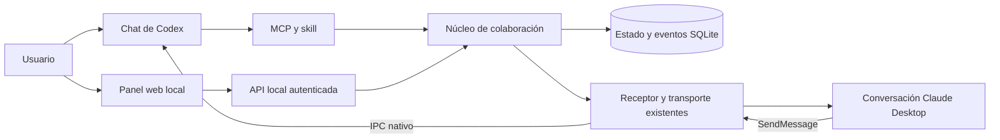
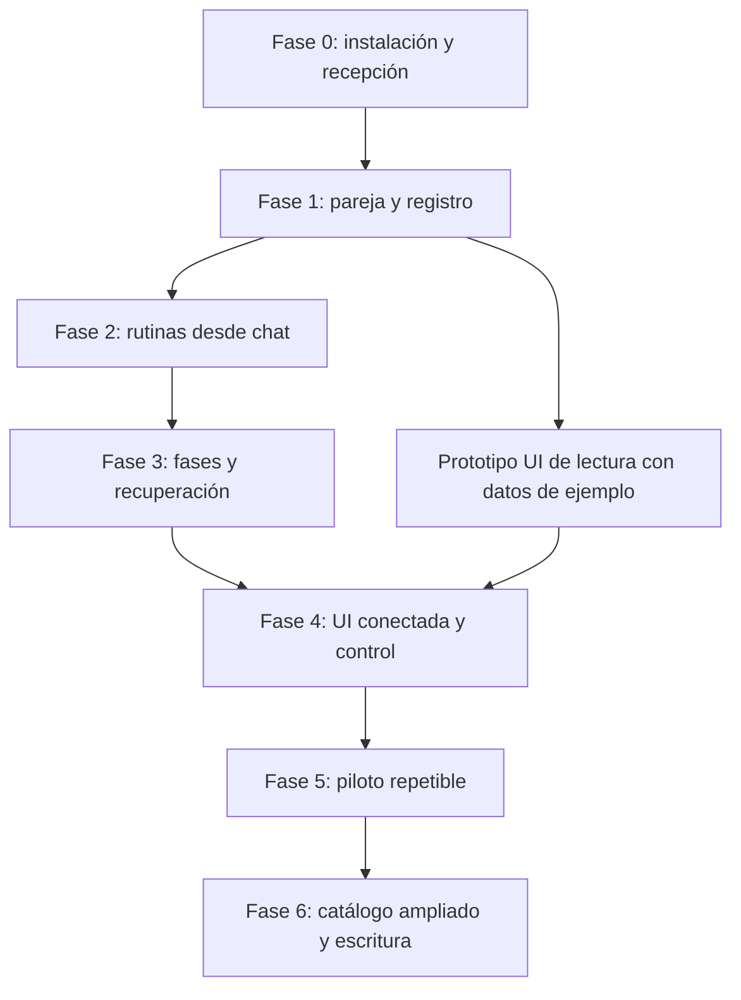

# Plan de implementación de CC–CDX Bridge

**Fecha:** 3 de octubre de 2026, zona America/New_York.\
**Estado:** fases 0–4 fusionadas en main. Fase 5 implementada en `feature/phase-5-pilot-hardening`, candidata 0.7.0: 136 pruebas y 1051 aserciones por suite fuente/bundle, CI Linux/macOS aprobada para el arreglo final, siete comprobaciones CLI reales y ensayos Desktop activo/inactivo desde panel. Autorización recordada conservada, sin reenvíos ni consenso certificado. Reapertura completa con MCP/receptor 0.7.0, continuación de análisis existentes y pausa/contexto desde UI verificadas. Chats nuevos y nombres iguales verificados en 0.7.0, sin attach manual y con recepción default heredada. Diecisiete casos nativos actuales; L08 respaldado por prueba histórica y regresión actual. Codex temporal archivado; pendiente archivar Claude cuando se desbloquee el Mac. El cierre administrativo de fase 5 sigue pendiente de esa limpieza. Plan de continuidad y evidencia en [FASE_5.md](FASE_5.md), [PILOTO.md](PILOTO.md) y [PILOT_EVIDENCE.json](PILOT_EVIDENCE.json). Fase 6 implementada en `feature/phase-6-coordinated-work`, candidata 0.8.0, con catálogo ampliado y preparación de implementación opt-in; validación local y límites en [FASE_6.md](FASE_6.md).\
**Repositorio:** [jaimebernalm/cc-cdx-bridge](https://github.com/jaimebernalm/cc-cdx-bridge).\
**Base auditada:** `LeonKohli/claude-uds-bridge`, commit `49f237dfa50526fc47c1e7514005c8820615df19`.\
**Alcance actual:** fases 0–5 implementadas, con validación nativa final de fase 5 pendiente; pareja y transporte gestionado, colaboración libre por defecto, orientaciones opcionales, análisis nuevos/existentes/mixtos, resultados y revisiones atribuidos, coordinación estructurada opcional y UI conectada. Los modelos eligen las tareas desde sus chats. El receptor registra transporte y libera entradas autorizadas; no hay supervisor que genere investigación desatendida. La validación de reinicios/actualización y la matriz completa de piloto pertenecen a fase 5.

## Guía de lectura

El plan tiene dos entregas distinguibles: **piloto útil desde el chat** al terminar las fases 0–2, y **producto con panel y recuperación estructurada** al terminar las fases 3–5. La implementación coordinada de código queda para la fase 6. No es necesario completar todo el documento para empezar a usar las dos primeras rutinas.

- Para decidir qué construir: secciones 1, 3, 5 y 20.
- Para revisar la experiencia y la UI: secciones 4 y 17.
- Para entender el bloqueo real de recepción: secciones 2, 9 y 10.
- Para implementar el núcleo: secciones 7, 8 y 11–16.
- Para organizar entregas y comprobar resultados: secciones 21–26.

### Índice

- [1. Decisión de producto](#1-decisión-de-producto)
- [2. Estado real del proyecto](#2-estado-real-del-proyecto)
- [3. Objetivos y límites de la primera versión](#3-objetivos-y-límites-de-la-primera-versión)
- [4. Experiencia de uso](#4-experiencia-de-uso)
- [5. Catálogo de rutinas](#5-catálogo-de-rutinas)
- [6. Rondas, mensajes y límites](#6-rondas-mensajes-y-límites)
- [7. Arquitectura propuesta](#7-arquitectura-propuesta)
- [8. Selección de conversaciones e identidad de proyecto](#8-selección-de-conversaciones-e-identidad-de-proyecto)
- [9. Recepción y permisos: primer bloqueo de producto](#9-recepción-y-permisos-primer-bloqueo-de-producto)
- [10. Activación persistente y conversaciones antiguas](#10-activación-persistente-y-conversaciones-antiguas)
- [11. Preparación del contexto](#11-preparación-del-contexto)
- [12. Protocolo de colaboración](#12-protocolo-de-colaboración)
- [13. Estado y ciclo de vida de una colaboración](#13-estado-y-ciclo-de-vida-de-una-colaboración)
- [14. Persistencia y modelo de datos](#14-persistencia-y-modelo-de-datos)
- [15. Recuperación, cancelación y cierre](#15-recuperación-cancelación-y-cierre)
- [16. API de aplicación y herramientas MCP](#16-api-de-aplicación-y-herramientas-mcp)
- [17. Diseño detallado de la UI](#17-diseño-detallado-de-la-ui)
- [18. Servicio local, acceso y ciclo de ejecución](#18-servicio-local-acceso-y-ciclo-de-ejecución)
- [19. Exportaciones y resultados reproducibles](#19-exportaciones-y-resultados-reproducibles)
- [20. Plan de implementación por fases](#20-plan-de-implementación-por-fases)
- [21. Dependencias y estrategia de entrega](#21-dependencias-y-estrategia-de-entrega)
- [22. Backlog propuesto por cambios revisables](#22-backlog-propuesto-por-cambios-revisables)
- [23. Archivos existentes que habrá que modificar](#23-archivos-existentes-que-habrá-que-modificar)
- [24. Estrategia de pruebas](#24-estrategia-de-pruebas)
- [25. Cómo evaluar si mejora el trabajo](#25-cómo-evaluar-si-mejora-el-trabajo)
- [26. Condiciones de salida del piloto](#26-condiciones-de-salida-del-piloto)
- [27. Riesgos y decisiones pendientes](#27-riesgos-y-decisiones-pendientes)
- [28. Decisiones de diseño registradas](#28-decisiones-de-diseño-registradas)
- [29. Relación con upstream y mantenimiento](#29-relación-con-upstream-y-mantenimiento)
- [30. Ejemplos de instrucciones de uso previstas](#30-ejemplos-de-instrucciones-de-uso-previstas)
- [31. Primeras acciones cuando se autorice implementar](#31-primeras-acciones-cuando-se-autorice-implementar)
- [32. Fuentes y evidencia](#32-fuentes-y-evidencia)

## 1. Decisión de producto

Ampliar el puente existente para que una persona pueda conectar una conversación de Codex Desktop con una conversación local de Code dentro de Claude Desktop, elegir cómo deben colaborar y seguir el resultado desde sus aplicaciones habituales.

La experiencia debe permitir dos entradas equivalentes:

- **Desde el chat:** «Investiga esto con Claude», «Revisad este cambio entre los dos» o «Continuad a partir de vuestros análisis».
- **Desde una UI local:** elegir conversaciones, describir el objetivo, conservar colaboración libre o elegir una ayuda opcional y pulsar **Iniciar colaboración**.

Ambas entradas utilizarán el mismo núcleo de sesiones, estado, mensajes y resultados. La UI será un panel de control y lectura; las conversaciones originales seguirán siendo los lugares donde trabajan los agentes.

La primera entrega útil tendrá **colaboración libre** como opción inicial, y dos ayudas opcionales: **Investigación conjunta** y **Revisión cruzada**. El catálogo se ampliará cuando estas funcionen de manera repetible. Los usos se presentarán como orientaciones editables. No impondrán un orden de análisis, propuesta y crítica; las fases intelectuales y las barreras de independencia descritas más adelante solo se aplicarán cuando se elija expresamente ese enfoque.

La coordinación intelectual recaerá inicialmente en Codex y Claude. El código se ocupará de identidad, entrega, registro, correlación, límites y recuperación. No se incorporará un tercer modelo únicamente para dirigir la conversación.

### 1.1. Qué aportará la UI

La UI merece existir porque facilita decisiones que hoy son difíciles de expresar sin conocer identificadores y estados internos:

1. Distinguir varias conversaciones abiertas sobre el mismo proyecto.
2. Elegir si se empieza una investigación o se aprovecha trabajo previo.
3. Ver qué está haciendo cada participante y por qué está esperando.
4. Consultar el intercambio sin buscar mensajes en dos ventanas.
5. Pausar, cancelar, reanudar y exportar el resultado.

No se construirá inicialmente otra aplicación nativa completa. La propuesta es una **web local**, abierta en el navegador habitual o en el navegador integrado de Codex cuando sea compatible. No se asumirá que puede insertarse como panel nativo dentro de ambas apps.

### 1.2. Qué significa «funciona»

Un usuario puede iniciar una colaboración desde sus conversaciones existentes, ver que los mensajes llegan al destinatario correcto, obtener una respuesta atribuible a cada agente y terminar con un resultado revisado o con un desacuerdo explicado.

Un mensaje escrito en un socket, una notificación de inactividad o una conclusión redactada únicamente por un participante no bastan para demostrar ese comportamiento.

## 2. Estado real del proyecto

### 2.1. Capacidades heredadas

| Componente | Capacidad existente | Archivo principal |
|---|---|---|
| MCP de Codex | Listar agentes, enviar mensajes, consultar estado y gestionar recepción | `plugins/claude-uds-bridge/src/server.ts` |
| Ciclo de vida | Crear y retirar el receptor por conversación | `src/hook.ts`, `hooks/hooks.json` |
| Descubrimiento Claude | Leer registros locales, comprobar procesos y sockets | `src/claude.ts` |
| Entrega a Codex | Introducir texto en el chat existente, activo o inactivo | `src/desktop.ts` |
| Correlación de entrada | Distinguir entradas aceptadas de entradas consumidas | `src/desktop-input.ts` |
| Persistencia de transporte | Guardar mensajes y estados por conversación en SQLite | `src/bridge.ts` |
| Controles de recepción | Aceptar, retener, rechazar y resolver mensajes retenidos | `src/bridge.ts`, `src/held-dialogs.ts` |
| Protecciones | Duplicados, capacidad, frecuencia, cadenas de saltos e identidad de proceso | `src/guard.ts`, `src/outbound.ts`, `src/claude.ts` |

Las rutas abreviadas `src/...` de esta tabla están dentro de `plugins/claude-uds-bridge/`.

### 2.2. Trabajo añadido en nuestra copia

- Prueba real opcional: `scripts/desktop-smoke.ts`.
- Selección específica de Claude Desktop y validación de respuesta: `src/smoke.ts`.
- Comprobación del proyecto del chat Codex: `readDesktopProject`.
- Pruebas de selección de sesión y de correlación del reto.
- Documentación de la comprobación real y de la limitación de ajustes de recepción.
- Base de fase 0: diagnóstico/activación, lanzador y validación de distribución.
- Núcleo de fase 1: identidad Git/proceso, ejecución/contexto/participantes/eventos, reserva de conversaciones, mensajes gestionados con límites, cancelación/cierre y exportación Markdown/JSON. Detalle de implementación y continuidad en [FASE_1.md](FASE_1.md).

Estos cambios existen en el árbol de trabajo. Al redactar el plan, `HEAD` sigue siendo el commit original; no debe tratarse el trabajo local como una versión ya publicada del fork.

### 2.3. Evidencia comprobada

El 3 de octubre de 2026 se completó un intercambio real:

1. Esta conversación de Codex envió un reto aleatorio a una conversación de Claude Desktop situada en el mismo proyecto.
2. Claude respondió mediante su herramienta nativa `SendMessage`.
3. El puente entregó la respuesta al chat original de Codex.
4. El comprobador verificó la respuesta correcta, la aceptación de la entrega y el consumo de la entrada.

El reto fue `73 + 82`, con resultado `155` y un identificador único coincidente. El motor de esa sesión Claude Desktop era `2.1.286`. Bun era `1.4.2`. El CLI independiente de Claude se actualizó a `2.1.288`; esa actualización no cambió por sí sola el motor de la sesión Desktop.

La suite inicial de la copia ampliada pasó **42 pruebas**. Después de implementar la fase 0 y corregir la confusión entre retenciones salientes y aprobaciones entrantes pasa **49 pruebas**, con comprobación de tipos, compilación y repetición sobre los bundles. Los casos de protocolo usan contrapartes simuladas y no sustituyen la evidencia de las apps reales.

La prueba necesitó una autorización temporal de recepción en los ajustes de usuario de Claude y la liberación de la respuesta exacta en Codex. Después se restauró el ajuste y se retiró el receptor temporal.

En la comprobación posterior de fase 0, un chat temporal autorizado inició su receptor automáticamente y lo retiró al archivarse. Las herramientas MCP ya están cargadas en el chat principal. Un reto nuevo enviado con los ajustes actuales quedó retenido por Claude y caducó sin respuesta; no se ampliaron permisos ni recepción. Los detalles se conservan en [FASE_0.md](FASE_0.md) y [COMPATIBILIDAD.md](COMPATIBILIDAD.md).

### 2.4. Lo que aún no está demostrado

- Todos los casos de reanudación, desconexión y orden de carga de hooks; se ha probado arranque y archivo de un chat nuevo.
- Recepción desatendida cuando las clases de permisos difieren, sin intervención global inesperada.
- Varias rondas completas, con revisión final por ambos participantes.
- Recuperación automática después de cerrar o reiniciar una app.
- Conservación efectiva de todos los análisis antiguos tras compactaciones de contexto.
- UI, catálogo de rutinas, exportación de colaboración y cierre verificable.
- Compatibilidad real en Linux o Windows. Los fixtures en Linux no prueban apps reales allí.

La auditoría inicial en `audit/REPORT.txt` es histórica: precede al intercambio real y a la instalación de Bun. Sus afirmaciones sobre lo que entonces faltaba no describen por completo el estado posterior.

## 3. Objetivos y límites de la primera versión

### 3.1. Objetivos

| ID | Requisito | Criterio observable |
|---|---|---|
| R01 | Usar las conversaciones Desktop elegidas | Los IDs originales permanecen y el resultado vuelve a esas conversaciones |
| R02 | Evitar destinatarios ambiguos | Dos sesiones con el mismo nombre requieren selección explícita |
| R03 | Verificar el proyecto | Se muestra carpeta, repositorio y revisión de cada participante |
| R04 | Elegir rutina | Investigación y revisión aparecen como opciones utilizables |
| R05 | Aprovechar análisis anteriores | Cada participante puede aportar una síntesis de su contexto existente |
| R06 | Empezar con análisis independientes | No se comparte la propuesta de A antes de registrar la de B en ese modo |
| R07 | Registrar el intercambio | Cada mensaje tiene autor verificado, fecha, relación con la colaboración y estado |
| R08 | Diferenciar entrega y respuesta | La UI no muestra «respondió» a partir de `socket-written` o `idle` |
| R09 | Revisar la conclusión | El resultado registra la evaluación de ambos sobre la misma versión |
| R10 | Mantener desacuerdos | El cierre puede ser válido con desacuerdos explícitos |
| R11 | Pausar y cancelar | El puente deja de programar nuevas entregas de esa colaboración |
| R12 | Aplicar límites | Se bloquean nuevas entregas al superar los límites configurados |
| R13 | Recuperar sin duplicar a ciegas | Una entrega incierta se reconcilia o requiere una decisión explícita |
| R14 | Mostrar bloqueos de recepción | Se explica qué lado retuvo el mensaje y qué alcance tendría el remedio |
| R15 | Ofrecer UI y chat equivalentes | Ambas entradas producen los mismos eventos y estados |
| R16 | Exportar | Markdown para leer y JSON para conservar la estructura |
| R17 | Respetar la intervención humana | Una instrucción nueva invalida o revisa las tareas afectadas |
| R18 | Funcionar sin terminal en cada intercambio | La terminal queda para instalación y diagnóstico avanzado |

### 3.2. Fuera de la primera versión

- Más de dos agentes en la misma colaboración.
- Conversaciones normales de Claude Chat o Cowork.
- Integración remota entre máquinas.
- Sustituir automáticamente una sesión Desktop por un proceso CLI.
- Crear conversaciones nuevas sin que el usuario haya elegido hacerlo.
- Modificar código en paralelo, resolver merges, publicar cambios o desplegar.
- Prometer un coste monetario exacto o imponer un límite de tokens sin métricas fiables.
- Importar todo el historial privado de las apps.
- Ejecutar sin las apps abiertas o sin una sesión accesible.
- Un marketplace público de rutinas, cuentas de usuario o sincronización en la nube.

Estos límites corresponden al producto inicial. Algunos usos posteriores, como implementación paralela, están contemplados en el catálogo pero permanecerán deshabilitados hasta completar sus requisitos.

## 4. Experiencia de uso

### 4.1. Inicio desde Codex

Ejemplo:

> Trabaja con la conversación de Claude de este proyecto. Usad Investigación conjunta para estudiar cómo mejorar la recuperación de información. Ambos ya tenéis análisis previos; partid de ellos y entregad una propuesta revisada por los dos.

Flujo previsto:

1. La skill reconoce la rutina y consulta las sesiones elegibles.
2. Si existe una pareja ya elegida y sigue siendo válida, la reutiliza.
3. Si hay ambigüedad, presenta las opciones antes de enviar contenido.
4. Prepara objetivo, restricciones, modo de inicio y resultado esperado.
5. Ejecuta el diagnóstico de recepción y capacidades.
6. Crea la colaboración y devuelve un enlace a su panel.
7. Coordina el trabajo y muestra la conclusión en la conversación de origen.

No se pedirá de nuevo una autorización ya vigente para esa colaboración. Un cambio de destinatario, alcance o ajuste global sí constituye una decisión distinta.

### 4.2. Inicio desde la UI

La pantalla tendrá cinco bloques principales:

1. **Conversaciones:** Codex y Claude, con proyecto, título o nombre disponible y estado.
2. **Qué queréis hacer:** selector de rutina con descripción y resultado esperado.
3. **Punto de partida:** empezar el análisis, usar análisis existentes o combinar ambos.
4. **Objetivo:** pregunta, restricciones y referencias seleccionadas.
5. **Iniciar:** resumen breve y avisos concretos si existe algún bloqueo.

Los límites avanzados estarán plegados por defecto. El usuario no debería necesitar conocer MCP, UDS, IDs de procesos o clases internas de permisos.

### 4.3. Dos modos de inicio, por participante

**Nuevo análisis:** utiliza una conversación existente, pero pide un análisis nuevo sobre el objetivo. No significa crear un chat nuevo.

**Análisis existente:** solicita una síntesis de hallazgos, evidencias, dudas y decisiones que ese agente ya haya desarrollado. No presupone que recuerde contenido perdido por compactación.

Se permitirá una combinación: Codex puede aportar análisis previo mientras Claude investiga desde el principio. La UI indicará la asimetría para no presentar ambos resultados como investigaciones independientes equivalentes.

### 4.4. Durante el trabajo

El usuario verá una frase de estado concreta: «Claude está comprobando dos objeciones», «Falta la revisión de Codex» o «Claude retuvo el mensaje». El estado no se deducirá únicamente de que la app esté ocupada o inactiva.

Podrá:

- Consultar mensajes y evidencias compartidas.
- Añadir una restricción o una pregunta.
- Pedir que se cierre con el resultado disponible.
- Pausar el intercambio.
- Cancelar nuevas entregas.
- Exportar un resultado parcial.

### 4.5. Al terminar

La salida mostrará:

- Recomendación o hallazgos principales.
- Alternativas consideradas y razones para descartarlas.
- Evidencias que apoyan las afirmaciones importantes.
- Desacuerdos que quedan abiertos.
- Qué revisó cada agente y con qué resultado.
- Próximos pasos propuestos.
- Causa de cierre: completado, límite, cancelación, bloqueo o fallo.

Una colaboración que termina por tiempo no aparecerá como «acuerdo alcanzado».

## 5. Catálogo de rutinas

### 5.1. Rutinas previstas

| ID estable | Nombre en UI | Pregunta que resuelve | Resultado | Disponibilidad |
|---|---|---|---|---|
| `research` | Investigación conjunta | ¿Qué opciones merecen explorarse y con qué evidencias? | Recomendación y experimentos propuestos | Primera entrega útil |
| `review` | Revisión cruzada | ¿Qué problemas tiene este cambio o documento? | Hallazgos priorizados y condiciones de aprobación | Primera entrega útil |
| `diagnose` | Diagnóstico de un fallo | ¿Qué hipótesis explica mejor el comportamiento? | Causa probable, pruebas y verificación pendiente | Ampliación |
| `architecture` | Diseño de arquitectura | ¿Qué diseño satisface mejor estas restricciones? | Decisión técnica y alternativas | Ampliación |
| `product` | Planificación de funcionalidad | ¿Qué debemos construir y cómo comprobar su utilidad? | Alcance, casos de uso y plan de entrega | Ampliación |
| `test-design` | Diseño de pruebas | ¿Qué escenarios debemos comprobar? | Matriz de casos y criterios de aceptación | Ampliación |
| `compare` | Comparar alternativas | ¿Cuál de estas opciones conviene y por qué? | Comparación bajo criterios comunes | Ampliación |
| `parallel-build` | Implementación coordinada | ¿Cómo repartir cambios e integrarlos? | Cambios separados, revisión e integración | Fase posterior de escritura |

Una rutina será una configuración versionada del flujo común. No tendrá su propio sistema de sockets, historial o aprobación.

### 5.2. Investigación conjunta

**Entradas obligatorias:** objetivo y proyecto o contexto de trabajo.\
**Entradas opcionales:** fuentes iniciales, restricciones, hipótesis, áreas que explorar, fecha de referencia y formato de salida.

Secuencia:

1. Cada participante presenta su análisis inicial o síntesis previa.
2. Ambos reciben la propuesta del otro.
3. Cada uno identifica fortalezas, supuestos débiles, evidencias insuficientes y alternativas omitidas.
4. Se eligen las comprobaciones que podrían cambiar la recomendación.
5. Se revisan las propuestas con los resultados disponibles.
6. Un participante redacta el borrador final y el otro lo revisa.
7. Se registra la conclusión, con acuerdo o desacuerdos.

La rutina debe distinguir hechos observados, hipótesis e ideas propuestas. No presentará una idea como novedosa a escala mundial sin una investigación específica que lo respalde.

### 5.3. Revisión cruzada

**Entradas obligatorias:** material a revisar y criterios de revisión. En código: base, revisión candidata y alcance del diff.

Secuencia:

1. Fijar el material revisado: commit, diff identificado o versión del documento.
2. El autor resume la intención y las comprobaciones realizadas.
3. El revisor identifica problemas concretos, con ubicación, escenario y consecuencia.
4. El autor responde a cada hallazgo: aceptado, refutado con evidencia o pendiente.
5. El revisor vuelve a evaluar los puntos afectados.
6. La salida distingue defectos confirmados, riesgos pendientes y preferencias de estilo.

En la primera versión, revisar un cambio no autoriza a modificarlo. Si el usuario pide implementación, eso abre un alcance separado que deberá quedar identificado.

### 5.4. Reglas comunes de los presets

- Los roles son intercambiables; Claude no será siempre crítico ni Codex siempre autor.
- La rutina pide razonamientos resumidos y evidencia observable, no razonamiento interno privado.
- «Revisar» no obliga a inventar objeciones. Es válido concluir que no hay hallazgos justificados.
- Cada crítica debe indicar qué observación la confirmaría o refutaría cuando sea posible.
- Los cambios materiales en la conclusión requieren una revisión de su nueva versión.
- Las instrucciones de la rutina no modifican las reglas o permisos propios de cada app.
- El usuario puede editar objetivo, profundidad y formato sin duplicar el preset completo.

### 5.5. Rutinas personalizadas

Después de validar las dos primeras rutinas, permitir guardar una configuración como preset personal. Guardará instrucciones, fases, formatos y límites; no secretos, identificadores de sesiones efímeras ni autorizaciones reutilizables.

Las rutinas importadas serán datos. No podrán incorporar comandos arbitrarios de instalación o ejecución. La primera ampliación admitirá texto y estructuras declarativas; los plugins de código de terceros quedan fuera.

## 6. Rondas, mensajes y límites

### 6.1. Qué se deja a las instrucciones

La profundidad del análisis, el orden argumental, el estilo de crítica y la decisión de que una pregunta ya está suficientemente resuelta pueden empezar como instrucciones de la rutina.

Para la primera experiencia guiada, pedir hasta tres rondas suele ser una regla práctica. No es necesario construir un planificador complejo únicamente para contar tres intercambios.

### 6.2. Qué se controla en código

El código debe saber si una colaboración está activa, a quién pertenece, cuánto ha durado y cuántos mensajes gestionados ha generado. Debe poder negar una nueva entrega después de cancelarla o superar su límite.

Valores iniciales propuestos, sujetos a ajuste con pruebas:

| Parámetro | Valor inicial | Significado |
|---|---:|---|
| Rondas de crítica solicitadas | 3 | Límite de la rutina; será estructural al incorporar fases validadas |
| Mensajes de trabajo gestionados | 24 | Incluye instrucciones, análisis, críticas, revisiones y reparaciones del protocolo |
| Duración total | 45 min | Desde el inicio; incluye esperas para evitar sesiones olvidadas |
| Espera de respuesta por encargo | 10 min | Al vencer, se detiene el avance y se muestra qué falta |
| Reparaciones de formato | 1 por encargo | No entrar en un bucle pidiendo JSON correcto |
| Colaboraciones activas por conversación | 1 | Evita mezclar objetivos y respuestas |
| Mensaje de aplicación | 32 KiB de UTF-8 | Muy inferior al máximo del transporte; el exceso se resume o se referencia |

No se elegirá un máximo «ilimitado» por defecto. Ampliar un presupuesto agotado requiere una acción humana y deja un evento; un agente no puede concederse más presupuesto.

### 6.3. Definición de ronda

Una ronda de crítica se completa cuando ambos participantes han respondido a los encargos de revisión de esa ronda, o cuando se cierra explícitamente como incompleta. El análisis inicial, el borrador final y su validación se contabilizan como fases separadas.

En la versión guiada por prompts, la ronda declarada por un agente es informativa. En la versión estructurada, el núcleo asigna los encargos y valida la transición. Nunca se interpretará un número escrito por el modelo como una autoridad para saltar de fase.

### 6.4. Alcance real de los límites

- El puente puede detener mensajes que pasan por sus rutas gestionadas.
- No puede detener retrospectivamente una herramienta ya ejecutándose en la app.
- No puede impedir que el usuario mande mensajes manuales fuera de la colaboración.
- No conoce necesariamente todos los tokens consumidos por cada app.
- Un límite de tiempo no equivale a un límite exacto de gasto.
- Las defensas heredadas de saltos pueden cortar antes que el presupuesto de la colaboración.

Los contadores de saltos y frecuencia se conservarán. No se borrará la cadena de origen para aparentar que un mensaje del agente es una instrucción humana nueva. Si las rondas previstas chocan con estos controles, se reducirá el flujo o se detendrá para una continuación explícita, conservando la procedencia.

## 7. Arquitectura propuesta

### 7.1. Componentes



El diagrama expresa responsabilidades, no exige crear todos los procesos desde la primera fase.

### 7.2. Evolución por tamaño

**Primera entrega desde chat:** mantener el receptor por conversación. Añadir módulos de selección, asociación de sesiones, registro y límites; los agentes deciden cómo abordar el objetivo, con orientaciones opcionales de la skill y sin una secuencia intelectual obligatoria.

**Entrega con UI:** añadir un servicio local ligero que unifique consultas y órdenes. El núcleo seguirá compartido con MCP. La UI no leerá ni escribirá directamente las bases de transporte.

**Entrega con recuperación:** convertir el servicio en propietario del estado de colaboración, con un único escritor por ejecución y un arranque idempotente. Los receptores conservarán su responsabilidad de integración con las apps.

No se creará un segundo receptor de Claude para el mismo chat Codex. El servicio se comunicará con el receptor existente mediante una interfaz local estrecha, autenticada y verificada por identidad de proceso.

### 7.3. Responsabilidad del núcleo

- Validar participantes, objetivo y compatibilidad.
- Crear una ejecución y asignar encargos.
- Persistir decisiones de transición, autorizaciones de alcance y eventos.
- Aplicar presupuestos antes de programar una entrega.
- Correlacionar respuestas con encargos y versiones.
- Generar exportaciones deterministas a partir del registro.
- Mantener invariantes de pausa, cancelación y cierre.

El núcleo no evaluará por sí solo si una conclusión científica o técnica es cierta. Registrará qué evidencia se aportó y quién la revisó.

### 7.4. Responsabilidad de los adaptadores

**Codex Desktop:** comprobar propietario, proyecto, capacidades, modo de ejecución observable, entrega y consumo. Mantener la validación del stream interno compatible; una versión desconocida debe generar un diagnóstico, no aceptarse por parecido.

**Claude Desktop:** descubrir únicamente la superficie seleccionada, verificar proceso y dirección, enviar al socket validado y recibir mensajes nativos. No asumir que «Claude» en una lista significa Desktop: pueden existir sesiones de terminal y VS Code.

La detección de política efectiva devolverá `unknown` si no puede demostrarla. Leer un ajuste aislado no basta para resolver toda la precedencia de una app.

### 7.5. Dependencias y estructura

Mantener Bun, TypeScript, Zod y SQLite. Para la UI, usar TypeScript y una solución pequeña; React con un empaquetado estático es una opción razonable. La decisión concreta se tomará al implementar la UI después de verificar dependencias vigentes. No hacen falta SSR, base de datos remota ni autenticación con una cuenta nueva.

Estructura orientativa futura:

```text
plugins/claude-uds-bridge/
  src/
    bridge.ts                    # Transporte existente y puntos de integración
    claude.ts
    desktop.ts
    desktop-input.ts
    collaboration/
      types.ts                   # Contratos y validación Zod
      discovery.ts               # Sesiones, superficies e identidad de proyecto
      preflight.ts               # Diagnóstico y bloqueos
      store.ts                   # Persistencia y migraciones
      engine.ts                  # Estado y transiciones
      routing.ts                 # Rutas gestionadas y correlación
      budgets.ts                 # Límites atómicos
      reconciliation.ts          # Entregas inciertas
      permissions.ts             # Recepción, alcance y restauración
      export.ts                  # Markdown y JSON
      presets.ts                 # Carga y validación del catálogo
    control/
      service.ts                 # Propietario local del núcleo, fase UI
      http.ts                    # API local y eventos
  presets/
    research.json
    review.json
  skills/
    collaborate/SKILL.md
  ui/
  scripts/
    desktop-smoke.ts
    doctor.ts
  test/
docs/
  PLAN_IMPLEMENTACION.md
  architecture/
```

Estas rutas nuevas son propuestas, no archivos ya implementados. Evitar dividir el proyecto en muchos paquetes antes de que exista una necesidad real.

## 8. Selección de conversaciones e identidad de proyecto

### 8.1. Datos que debe devolver el descubrimiento

Cada registro mostrará proveedor, superficie, ID estable de conversación, nombre disponible, carpeta, estado del proceso, inicio de sesión y capacidades conocidas. PID, socket y `procStart` servirán para verificación interna, no como identidad duradera de la conversación.

Los datos desconocidos se mostrarán como desconocidos. No se inferirá el modelo activo a partir del nombre de una app, ni se mostrará una versión del CLI como si fuera la del motor Desktop.

### 8.2. Elegibilidad

Para la primera versión:

- Codex debe ser un chat local accesible por el adaptador Desktop.
- Claude debe tener `entrypoint === 'claude-desktop'` y proceso verificado.
- La selección requiere IDs exactos; un nombre o una coincidencia de carpeta solo ayudan a presentar opciones.
- Una conversación ocupada en otro trabajo no se incorporará automáticamente.
- Una sesión caducada permanece en el historial, pero no es destinataria de nuevos mensajes.

Codex no dispone en este código de un catálogo general de todos sus chats. Inicialmente se listarán los chats registrados por el plugin y el chat de origen. Añadir un explorador completo de conversaciones Codex requiere otra capacidad validada; no se obtendrá rastreando indiscriminadamente sus historiales internos.

### 8.3. Validación del proyecto

Para una carpeta Git, guardar:

- Ruta canónica y raíz del worktree.
- Directorio Git común, para reconocer worktrees del mismo repositorio.
- Commit HEAD y rama cuando exista.
- Estado limpio/sucio y una huella del diff relevante cuando se revisen cambios locales.
- Identificador de snapshot de archivos no rastreados si forman parte del alcance.

No identificar repositorios únicamente por el remoto: puede faltar, cambiar o contener credenciales. Cualquier URL guardada para mostrar se saneará.

Dos worktrees del mismo repositorio pueden estar en revisiones distintas. Eso puede ser correcto para comparar alternativas, pero debe quedar explícito. Para una revisión de código se exige una base de comparación fijada.

Para carpetas sin Git, registrar rutas y referencias seleccionadas; indicar que no existe una revisión reproducible completa.

### 8.4. Asociación y cambios de proceso

Una pareja pertenece a una colaboración concreta. Si Claude reinicia su proceso pero conserva una identidad de conversación demostrable, puede actualizarse la dirección tras validación. Si cambia el ID o la relación con el proyecto no es segura, solicitar una nueva selección.

No sustituir silenciosamente una conversación desaparecida por otra con el mismo título.

## 9. Recepción y permisos: primer bloqueo de producto

### 9.1. Hallazgo que condiciona el plan

La prueba mostró que Codex estaba clasificado como `bypass` y Claude como `prompting`. El primer mensaje quedó retenido. Un `accept` guardado en el proyecto no lo liberó; el ensayo posterior con el ajuste de usuario sí permitió el intercambio y se restauró al terminar.

La [documentación de ajustes de Claude](https://code.claude.com/docs/en/settings#exceptions-to-managed-settings-precedence) confirma que los valores de proyecto/local solo prevalecen para restringir más la recepción. La [documentación de mensajería](https://code.claude.com/docs/en/cross-session-messaging#control-inbound-messages) explica la retención por clases de permisos y la ausencia del diálogo individual en Desktop.

### 9.2. Estrategia de implementación

Orden de preferencia:

1. Sesiones cuya configuración actual ya permite la comunicación.
2. Configuración específica de la sesión mediante una capacidad soportada y comprobada en la superficie utilizada.
3. Si solo existe un ajuste global, explicar su alcance y exigir una decisión humana explícita.

El flag `--settings` permite una configuración por proceso Claude Code, pero eso no demuestra que pueda cambiarse la configuración del proceso de una conversación Desktop ya abierta. Esta capacidad queda como investigación de compatibilidad, no como solución disponible prometida.

No se corregirá un bloqueo mintiendo sobre la clase de permisos del remitente, modificando protecciones de ejecución o sustituyendo Desktop por CLI sin indicarlo.

### 9.3. Diagnóstico previo

El diagnóstico producirá uno de estos estados:

| Estado | Significado | Acción |
|---|---|---|
| `ready` | Capacidades y recepción suficientemente verificadas | Permitir inicio |
| `needs_receiver` | Falta receptor en el chat Codex | Ofrecer activación validada |
| `needs_selection` | Participantes ambiguos o ausentes | Elegir conversación |
| `permission_mismatch` | La recepción puede retener mensajes | Mostrar el lado afectado y opciones reales |
| `policy_unknown` | No se puede determinar la recepción efectiva | Permitir una comprobación explícita o mostrar limitación |
| `unsupported_version` | Contrato de app no reconocido | Bloquear envíos gestionados y mostrar diagnóstico |
| `busy_elsewhere` | La sesión parece ocupada fuera de la colaboración | Esperar o pedir decisión |

Una comprobación de ida y vuelta inicia trabajo del modelo y consume uso; no se ejecutará silenciosamente cada vez que la UI refresque una lista.

### 9.4. Autorización y alcance

Separar tres conceptos:

- Autorización para que estas conversaciones colaboren sobre este objetivo.
- Autorización para recibir mensajes pese a una diferencia de clases de permisos.
- Permisos de ejecución y acceso a archivos que conserva cada sesión.

El sistema guardará el alcance de las autorizaciones humanas, sin tratar un campo `approved: true` enviado por un agente como prueba de aprobación humana. Una aprobación dada en una prueba anterior no habilita automáticamente cualquier cambio global futuro.

### 9.5. Cambios temporales de configuración

Si se admite esta opción en el producto:

1. Mostrar clave, alcance y valor previo efectivo o desconocido.
2. Obtener la autorización humana correspondiente.
3. Guardar un diario de restauración privado antes de modificar el archivo.
4. Aplicar el cambio mínimo y verificar su efecto.
5. Restaurar al finalizar, cancelar o fallar.
6. Ante cambios concurrentes, restaurar solo la clave propia cuando sea seguro; conservar otros cambios.
7. Tras una caída, detectar el diario pendiente al siguiente arranque y ofrecer/restablecer el valor previo según el alcance autorizado.

No prometer restauración inmediata si el proceso completo muere y ningún supervisor queda activo. Esta limitación es una razón para no usar un ajuste global temporal como mecanismo habitual de cada colaboración.

Un permiso de recepción específico de la pareja en nuestro receptor solo controla el lado Codex. No puede estrechar por sí solo el alcance de un `accept` global en Claude.

### 9.6. Modo de análisis

La primera versión pedirá trabajo de análisis y revisión. Si una app ofrece un modo efectivo de solo lectura adecuado, se comprobará y mostrará. Si solo existe una instrucción textual de no editar, la UI lo dirá como restricción solicitada, sin presentar un candado que sugiera una protección técnica inexistente.

## 10. Activación persistente y conversaciones antiguas

### 10.1. Instalación del fork

- Dar al marketplace y a la distribución del fork una identidad distinguible de `leonkohli`.
- Conservar licencia MIT, atribución y referencia al upstream.
- Documentar qué plugin se instala y desde qué revisión.
- Mantener las identidades de transporte existentes cuando formen parte de comprobaciones de compatibilidad, o migrarlas explícitamente.
- Resolver Bun y las rutas de ejecutables en el entorno real de la app, no solo en la shell del usuario.
- Compilar `dist/` y verificar que corresponde al código fuente distribuido.

No basta con cambiar `name` en un manifiesto: revisar referencias MCP, hooks, directorios de estado, cachés y compatibilidad de instalaciones anteriores.

### 10.2. Hooks y activación

El plugin original usa `SessionStart` y `SessionEnd`. La instalación de plugins y la confianza de hooks tienen un ciclo propio en Codex; la [documentación oficial de plugins](https://learn.chatgpt.com/docs/plugins) exige revisar y confiar los hooks y describe su disponibilidad en nuevas conversaciones.

La primera tarea será validar el ciclo real con este fork. No se supondrá que un plugin recién instalado añade herramientas automáticamente al chat que ya está abierto.

### 10.3. Activación de un chat existente

Proponer una operación idempotente `attach_current` que:

1. Obtenga la identidad del chat desde metadatos confiables del host.
2. Compruebe acceso nativo y proyecto.
3. Reutilice un receptor existente y válido.
4. Cree uno solo si no existe y la activación está autorizada.
5. No borre historial ni ejecute `/clear`.
6. Informe si el MCP o las herramientas aún no están disponibles en ese chat.

El ensayo actual demuestra que se puede registrar temporalmente este chat desde un script. Convertirlo en una experiencia soportada y persistente requiere comprobar la carga de herramientas y la confianza de hooks; no se tratará el script como un bypass de esos mecanismos.

### 10.4. Fallo de arranque

Revisar `required: true` del MCP. La propuesta es que un puente opcional no impida abrir un chat ordinario si Bun o el servicio están ausentes. Cambiar ese comportamiento requiere probar el orden de hooks y disponibilidad MCP; no basta con poner `required: false` sin más.

El diagnóstico deberá ofrecer una causa y un remedio precisos: runtime ausente, plugin no cargado, hook sin confianza, receptor detenido o app incompatible.

## 11. Preparación del contexto

### 11.1. Paquete de trabajo común

Cada colaboración almacenará una versión de:

- Objetivo y pregunta que debe resolverse.
- Restricciones del usuario.
- Proyecto y revisión de referencia.
- Rutina y roles.
- Criterios de éxito.
- Material que el usuario decidió compartir.
- Límites de tiempo, mensajes y alcance.

Este paquete será idéntico para ambos participantes, salvo las instrucciones específicas de rol. Cualquier cambio relevante incrementa `contextVersion`.

### 11.2. Síntesis de análisis existentes

Solicitar a cada agente:

```text
Objetivo que estabas resolviendo:
Hallazgos principales:
Evidencias y referencias:
Decisiones ya tomadas y por quién:
Hipótesis todavía no verificadas:
Preguntas abiertas:
Contexto que ya no puedes recuperar:
```

Las decisiones declaradas por un agente se registran como tales. No se convierten automáticamente en instrucciones humanas vinculantes si no hay evidencia de su origen.

No se copiarán automáticamente conversaciones enteras, archivos `.env`, credenciales o contenido no relacionado. Compartir resúmenes explícitos es también una forma de mantener el debate enfocado y el registro legible.

### 11.3. Independencia del análisis

En modo independiente, el núcleo debe almacenar el resultado inicial de cada participante antes de entregar el del otro. La barrera se aplica en la capa de colaboración, antes de inyectar respuestas al chat receptor.

Esto requiere un punto de integración previo a `Bridge.deliver`: el comportamiento actual entrega inmediatamente el texto aceptado. Una skill por sí sola no garantiza aislamiento si Claude responde mientras Codex todavía está analizando.

La espera por la barrera pertenece al protocolo de colaboración y debe distinguirse de un mensaje retenido por permisos (`held`). Solo se procesa como resultado de trabajo el contenido cuya recepción ya esté autorizada; retenerlo para no influir en el otro análisis no permite eludir una retención de permisos. Los recibos describirán el hito real, sin afirmar que el modelo lo consumió mientras sigue detrás de la barrera.

Si un participante ya conoce el análisis del otro, marcar el inicio como «análisis previo compartido» o «independencia no garantizada». No intentar borrar el conocimiento de su conversación.

### 11.4. Evidencia

Registrar evidencias como referencias con autor, fecha, tipo y revisión aplicable. Ejemplos: archivo y línea, commit, resultado de una prueba, enlace web con fecha de consulta o experimento reproducible.

Distinguir:

- Evidencia aportada por un agente.
- Comprobación observada por el sistema, como un resultado de transporte.
- Evidencia revisada o reproducida por el otro agente.

Dos agentes repitiendo una misma afirmación no constituyen dos verificaciones independientes.

## 12. Protocolo de colaboración

### 12.1. Transporte y contenido

Mantener el protocolo de socket existente. Añadir dentro del texto una estructura de aplicación versionada. Claude seguirá usando `SendMessage`; no se exige instalar otro MCP en Claude para el primer flujo.

El parser quitará únicamente el sobre de transporte reconocido, validará el objeto de aplicación y almacenará también el texto original. No se ejecutará ningún campo como comando.

### 12.2. Sobre propuesto

Ejemplo ilustrativo; no es una API implementada:

```json
{
  "protocol": "cc-cdx-collaboration/1",
  "runId": "uuid",
  "messageId": "uuid",
  "taskId": "uuid",
  "inReplyTo": "uuid",
  "contextVersion": 1,
  "phase": "critique",
  "round": 1,
  "kind": "task_result",
  "body": {
    "summary": "Conclusión breve",
    "findings": [],
    "evidence": [],
    "openQuestions": [],
    "status": "complete"
  }
}
```

El núcleo asigna `runId`, `taskId`, fase y contexto esperado. Un participante solo puede contestar a un encargo existente que le pertenezca. La identidad del autor viene de la conexión y el registro validados, no de una propiedad del JSON.

Para Claude, el mensaje de encargo incluirá un sobre mínimo que pueda copiar, con campos de correlación ya rellenados. El núcleo asignará su propio ID al evento recibido y lo vinculará al `msg_id` real del transporte; no dependerá de que el modelo genere UUIDs correctamente.

### 12.3. Tipos de mensaje

| Tipo | Emisor permitido | Efecto |
|---|---|---|
| `task_request` | Núcleo autorizado | Presenta un encargo a un participante |
| `task_result` | Participante asignado | Registra una respuesta a ese encargo |
| `clarification_request` | Participante | Declara una duda; no cambia alcance por sí sola |
| `clarification_answer` | Usuario o participante autorizado | Responde con procedencia explícita |
| `draft` | Participante encargado de síntesis | Propone una versión de conclusión |
| `final_review` | Revisor asignado | Evalúa una versión concreta del borrador |
| `cannot_complete` | Participante | Explica un bloqueo o falta de contexto |

Pausa, cancelación, ampliación de presupuesto y aprobación de ajustes son operaciones de control. No son tipos de mensaje que un agente pueda usar para otorgarse autoridad humana.

### 12.4. Tolerancia a formato

Ante una respuesta legible pero mal formada:

1. Guardar el original y mostrar «respuesta recibida; no clasificada».
2. No avanzar de fase por una interpretación optimista.
3. Permitir una solicitud breve de reparación, incluida en los límites.
4. Si sigue fallando, detener el avance estructurado y conservar el resultado parcial.

La versión guiada puede mostrar texto libre y requerir clasificación del agente coordinador; la UI debe indicar que ese estado está declarado por un agente. La versión estructurada exige campos validados para avanzar automáticamente.

### 12.5. Mensajes que llegan fuera de contexto

- Un mensaje de otra sesión nunca satisface un encargo de la pareja elegida.
- Una respuesta con `contextVersion` antigua se conserva como tardía y no valida el resultado vigente.
- Una respuesta de una ejecución cerrada no abre otra ejecución.
- Un mensaje sin correlación del participante activo se pone en espera de clasificación; no inicia una cadena automática.
- Los mensajes ordinarios ajenos a la colaboración mantienen el comportamiento del puente general, con sus controles propios.

Para evitar bypasses accidentales de los límites, los envíos a la pareja asociada durante una colaboración deberán pasar por su ruta gestionada. Un envío manual excepcional se identificará como tal y no podrá aumentar el presupuesto automáticamente.

## 13. Estado y ciclo de vida de una colaboración

### 13.1. Estado de ejecución y fase separados

Guardar dos dimensiones:

- `status`: preparada, activa, pausada, bloqueada o terminal.
- `phase`: preparación, análisis, intercambio, verificación, síntesis o revisión final.

Así, una colaboración puede estar pausada durante una crítica sin perder qué debía ocurrir después.

Estados propuestos:

```text
draft → preflight → ready → running → completed
                    ↓         ↕
                  blocked    paused
                              ↓
                           cancelled

running → limit_reached | blocked | failed
blocked/paused → preflight → running
```

Un reinicio puede dejar una ejecución en `recovery_required` antes de que vuelva a `preflight`. Los estados terminales no vuelven directamente a `running`: continuar un resultado cerrado crea una ejecución vinculada, con nuevo presupuesto y contexto.

### 13.2. Fases de trabajo

1. `context`: recopilar objetivo y síntesis previas.
2. `independent_analysis`: recoger propuestas iniciales cuando corresponda.
3. `critique`: intercambiar observaciones sobre una versión identificada.
4. `verification`: comprobar afirmaciones decisivas.
5. `synthesis`: redactar una conclusión candidata.
6. `final_review`: revisión del mismo borrador por ambos participantes.

Algunas rutinas omiten fases. La revisión cruzada puede partir directamente de un cambio y su explicación, sin dos investigaciones iniciales.

### 13.3. Transiciones y autoridad

Cada transición debe indicar evento causante, actor, estado previo y nuevo estado. La decisión se realiza de forma transaccional con una versión esperada del registro para evitar que dos procesos avancen a la vez.

Una conclusión del modelo que diga «terminado» no cierra automáticamente la ejecución si faltan encargos o revisiones requeridas.

### 13.4. Intervención del usuario

Una intervención cambia `contextVersion` si altera objetivo, restricciones o material. Los encargos incompatibles quedan invalidados; las respuestas en curso se conservan y se etiquetan como anteriores al cambio.

Antes de enviar la siguiente instrucción, el núcleo comprueba si el usuario pausó, canceló o cambió el contexto. No se debe responder al usuario y seguir ejecutando el objetivo antiguo en segundo plano.

Detectar semánticamente cualquier mensaje escrito en las apps queda fuera de lo que hoy ofrece el adaptador. La primera versión ofrece controles explícitos y la skill debe atender las nuevas instrucciones; automatizar la detección exige validar eventos del host sin asumir acceso completo al historial.

## 14. Persistencia y modelo de datos

### 14.1. Ubicación

Conservar la base de transporte por conversación del upstream. Añadir estado de colaboración en un directorio privado del usuario, versionado por esquema. Separar datos de aplicación de la carpeta de instalación del plugin para que una actualización no los borre.

Las exportaciones al proyecto serán explícitas. Los registros internos no se subirán a Git por defecto. La prueba actual utiliza `.local/desktop-smoke/`, que seguirá siendo evidencia local de desarrollo.

### 14.2. Entidades

| Entidad | Campos esenciales | Invariantes |
|---|---|---|
| `runs` | ID, rutina/versión, objetivo, contexto/versión, estado, fase, presupuestos, fechas | Una versión vigente por ejecución |
| `participants` | run, proveedor, superficie, chat ID, proceso verificado, proyecto, rol | Dos participantes distintos |
| `tasks` | ID, run, participante, fase, ronda, contexto, dependencia, estado | Una respuesta vigente por versión de encargo |
| `messages` | ID propio, ID transporte, run/task, autor, destinatario, texto, hash | Identidad y procedencia conservadas |
| `deliveries` | message, intento, estado, ID de entrada nativa, recibos | Envío incierto no equivale a fallo seguro |
| `events` | secuencia, run, tipo, actor, fecha, payload | Orden estable y append-only lógico |
| `artifacts` | run, tipo, versión, contenido/hash, referencias | Una revisión apunta a una versión exacta |
| `reviews` | artifact hash, participante, decisión, observaciones | Cambiar contenido invalida aceptación anterior |
| `authorizations` | origen humano, alcance, expiración/revocación, referencia | Los agentes no pueden fabricar el origen |
| `leases` | recurso, propietario, generación, expiración | Un coordinador efectivo por ejecución |
| `settings_journal` | cambio temporal, valor anterior, alcance, restauración | Se puede detectar una restauración pendiente |

### 14.3. Entrega y trabajo del agente separados

No usar un único campo `status` para representar todo:

```text
Entrega: prepared → sending → written → accepted → consumed
                     └──────────────→ unknown
Otros resultados: held, refused, expired, dropped, cancelled_before_send

Encargo: pending → assigned → response_received → validated
Otros resultados: blocked, invalidated, timed_out, cancelled
```

Algunos hitos no son observables en ambas plataformas. Guardar capacidades y evidencia: una respuesta correlacionada demuestra que Claude procesó el encargo, aunque nunca llegue un recibo `delivered` separado. La prueba real ya mostró una respuesta válida mientras el estado de salida permanecía `socket-written`.

### 14.4. Atomicidad e idempotencia

- Reservar presupuesto y crear la intención de envío en una transacción.
- El transporte externo ocurre fuera de esa transacción; la intención persistida permite reconciliar una caída.
- Usar claves de idempotencia para órdenes de UI/MCP y para transiciones.
- Un doble clic en Iniciar no crea dos ejecuciones.
- Un evento recibido dos veces no produce dos entregas al modelo.
- Un proceso que perdió su lease no puede seguir programando mensajes.
- La recepción de un resultado y la transición que habilita la fase siguiente deben ser consistentes.

No prometer exactamente una ejecución del modelo sobre un transporte sin transacción distribuida. El objetivo es no reenviar a ciegas, deduplicar donde se pueda y hacer visible la incertidumbre.

### 14.5. Migraciones

Cada migración tendrá versión, prueba con una base anterior y copia recuperable antes de cambios destructivos. Los campos desconocidos de versiones futuras no deberán corromper el historial antiguo.

Las migraciones no reetiquetarán retrospectivamente mensajes antiguos como si hubieran sido consumidos o revisados. La evidencia que no exista permanecerá desconocida.

## 15. Recuperación, cancelación y cierre

### 15.1. Entregas inciertas

Corregir la separación incompleta del upstream entre `unknown` y consumo observado:

1. Conservar ID del mensaje, ID de entrada nativa y proceso destino.
2. Consultar evidencia de consumo cuando esté disponible.
3. Registrar el consumo como hecho separado, aunque faltase el recibo inicial.
4. Emitir la actualización correlacionada que desbloquee al coordinador, una sola vez.
5. Si no se puede resolver, mantener el estado incierto y pedir una decisión, sin reenvío automático.

Para Claude, no asumir una API de lectura del consumo equivalente a Codex. Usar respuesta correlacionada y recibos disponibles; si faltan ambos, la incertidumbre permanece.

### 15.2. Reinicio de app o servicio

Al reconectar:

- Revalidar conversación, proyecto, versión compatible y proceso.
- Reconstruir estado desde eventos y encargos pendientes.
- No volver a enviar todos los mensajes con estado no terminal.
- Detectar respuestas tardías antes de crear nuevos encargos.
- Volver a ejecutar el diagnóstico de recepción.
- Mostrar qué parte se recuperó y qué parte sigue sin confirmación.

Usar reconexión con espera creciente y máximo de intentos; no sondear continuamente una app cerrada. La reanudación de trabajo del modelo depende de una política de continuación elegida por el usuario.

### 15.3. Pausa

Pausar impide programar nuevos encargos. Los mensajes ya enviados pueden seguir produciendo respuestas. Estas se guardan, pero no disparan una nueva fase mientras la colaboración esté pausada.

La UI debe decir «Intercambio pausado; un agente puede seguir terminando su turno», si corresponde. No prometer que se detuvo un comando externo.

### 15.4. Cancelación

Cancelar cierra la admisión de nuevas entregas de trabajo y de avances automáticos. Las respuestas tardías quedan en el historial como posteriores a la cancelación.

Mantener una marca de ejecución cancelada durante la retención del historial. Si se retira el receptor, no reutilizar su identidad para una nueva ejecución de forma que una respuesta vieja parezca vigente.

Un eventual botón para interrumpir además el turno de la app será una acción distinta, dependiente de soporte real y del alcance elegido. No formará parte de la primera cancelación del puente.

### 15.5. Cierre por límites

Al llegar al límite:

- No emitir nuevos encargos de trabajo.
- Exportar localmente lo ya disponible sin requerir otra llamada al modelo.
- Marcar qué tareas y revisiones faltan.
- Permitir que el usuario cree una continuación con nuevos límites.

Si se quiere reservar una última síntesis, su presupuesto debe reservarse antes de agotar el límite. Un «último mensaje» no será una excepción ilimitada al contador.

### 15.6. Criterio de resultado revisado

Un resultado puede marcarse como revisado por ambos cuando:

1. Existe un borrador con versión y hash fijados.
2. Cada participante ha emitido una revisión para ese mismo hash.
3. Las observaciones críticas están resueltas o documentadas como desacuerdo.
4. La revisión corresponde al contexto y material vigentes.

Las decisiones admitidas serán `accept`, `accept_with_caveats` y `disagree`. Un desacuerdo documentado puede cerrar la colaboración correctamente; la interfaz no lo transformará en unanimidad.

## 16. API de aplicación y herramientas MCP

### 16.1. Operaciones del núcleo

Todas las entradas, desde UI o chat, llamarán a operaciones comunes:

| Operación conceptual | Resultado | Control relevante |
|---|---|---|
| `discoverParticipants` | Lista de sesiones y capacidades | Lectura; no inicia turnos |
| `attachCurrent` | Receptor asociado al chat real de origen | Metadatos del host y activación autorizada |
| `preflightPair` | Diagnóstico de compatibilidad | No cambia ajustes automáticamente |
| `listPresets` | Catálogo y versiones | Solo presets válidos |
| `prepareRun` | Borrador de colaboración | Todavía no envía trabajo |
| `startRun` | Ejecución y primeros encargos | Alcance autorizado, participantes y lease válidos |
| `submitResult` | Resultado asociado a un encargo | El emisor debe ser el participante asignado |
| `getRun` | Estado materializado | Sin reactivar trabajo |
| `listEvents` | Historial paginado | Orden y cursor estables |
| `pauseRun` | Pausa persistida | No cancela herramientas de la app |
| `resumeRun` | Nuevo diagnóstico y continuación | Contexto, pareja y presupuesto aún válidos |
| `cancelRun` | Estado terminal | Idempotente |
| `continueRun` | Nueva ejecución vinculada | Nuevo alcance/presupuesto explícito |
| `exportRun` | Artefacto Markdown o JSON | No exporta historiales completos de las apps |

Los nombres son contratos propuestos. Al implementar, mantener una convención única en API, herramientas y eventos.

### 16.2. Herramientas para Codex

Conservar las herramientas existentes por compatibilidad. Añadir un conjunto pequeño, evitando que el agente tenga que conocer docenas de operaciones:

- `collaboration_prepare`: rutina, pareja, objetivo y punto de partida; devuelve diagnóstico y borrador.
- `collaboration_start`: inicia un borrador autorizado y devuelve el encargo que corresponde al chat actual.
- `collaboration_submit`: entrega un resultado o revisión del participante actual.
- `collaboration_status`: estado, tareas pendientes y enlace al panel.
- `collaboration_control`: pausa, reanudación o cancelación dentro del alcance permitido.
- `collaboration_export`: genera el artefacto final o parcial.

Los datos de identidad del caller seguirán viniendo de los metadatos verificados de Codex. No se permitirá que un argumento `threadId` arbitrario suplante otra conversación.

Para acciones que requieran aprobación humana, la herramienta devuelve la necesidad de aprobación o usa un mecanismo nativo validado. Un prompt del agente o una llamada MCP no constituyen por sí solos una decisión humana sobre ajustes globales.

### 16.3. Participación de Claude

Cada encargo recibido explicará cómo contestar usando `SendMessage` y qué identificadores deben acompañar la respuesta. El remitente registrado y el sobre de transporte proporcionarán la dirección de vuelta.

No se le pedirá que cambie su configuración por instrucciones de Codex. Si carece de una capacidad necesaria, debe devolver `cannot_complete` con una descripción breve, sin delegar al otro agente una acción bloqueada en su propia sesión.

### 16.4. API local de UI

Esquema inicial orientativo:

```text
GET    /api/v1/health
GET    /api/v1/participants
GET    /api/v1/presets
POST   /api/v1/preflight
POST   /api/v1/runs
GET    /api/v1/runs
GET    /api/v1/runs/:id
POST   /api/v1/runs/:id/start
POST   /api/v1/runs/:id/pause
POST   /api/v1/runs/:id/resume
POST   /api/v1/runs/:id/cancel
POST   /api/v1/runs/:id/continue
POST   /api/v1/runs/:id/inputs
GET    /api/v1/runs/:id/events?after=cursor
GET    /api/v1/runs/:id/stream
POST   /api/v1/runs/:id/exports
GET    /api/v1/artifacts/:id
```

`stream` puede utilizar Server-Sent Events. La UI debe poder reconstruirse desde la consulta paginada si pierde la conexión; no dependerá de recibir cada evento en vivo.

Las órdenes mutantes llevarán clave de idempotencia y versión esperada de ejecución. Un conflicto devuelve el estado actual y evita aplicar una acción sobre una pantalla obsoleta.

### 16.5. Inicio desde UI en un chat inactivo

Este caso merece una prueba propia. El panel debe activar el chat Codex seleccionado mediante el adaptador nativo, conservar su identidad y producir una instrucción de trabajo con procedencia correcta.

No se fabricarán metadatos de un turno MCP como si el agente ya hubiese llamado una herramienta. La UI crea una orden autorizada de colaboración; el receptor entrega el encargo por su mecanismo nativo, y el agente responde después mediante las herramientas disponibles.

Si el chat no tiene cargadas las herramientas necesarias, el panel mostrará el requisito de activación. No se iniciará una sesión CLI alternativa silenciosamente para aparentar que el chat original participa.

## 17. Diseño detallado de la UI

### 17.1. Principios visuales

- Español inicialmente, con textos centralizados para facilitar traducción.
- Una acción principal por pantalla.
- Identificación textual de los dos participantes; el color no será el único indicador.
- Estado y causa de espera visibles sin abrir logs.
- Detalles técnicos en un panel de diagnóstico desplegable.
- Navegación por teclado, foco visible y estados anunciados de forma accesible.
- Tema claro y oscuro siguiendo la preferencia del sistema.
- Vista útil en una ventana estrecha, adecuada a un panel lateral del navegador integrado.

### 17.2. Pantalla A: Inicio

Contenido:

- Botón **Nueva colaboración**.
- Colaboraciones activas o pausadas, con rutina, participantes y última actividad relevante.
- Resultados recientes.
- Estado de conexión de Codex Desktop y Claude Desktop.
- Acceso a **Diagnóstico**.

No mostrar un panel vacío con métricas irrelevantes antes de que exista una colaboración. El primer estado vacío explicará cómo conectar las conversaciones y qué tareas puede facilitar.

### 17.3. Pantalla B: Nueva colaboración

Wireframe conceptual:

```text
Nueva colaboración

Conversaciones
  Codex   [Proyecto · Conversación · disponible        v]
  Claude  [Proyecto · Conversación · disponible        v]
  ✓ Mismo repositorio      Revisión: ... / ...

¿Qué queréis hacer?
  [Investigación conjunta]  [Revisión cruzada]
  [Más rutinas]

Punto de partida
  Codex  [Usar su análisis existente v]
  Claude [Empezar un análisis nuevo  v]

Objetivo
  [Pregunta, restricciones y resultado esperado             ]

Referencias seleccionadas   [+ Añadir referencia]
Opciones avanzadas          [plegado]

[Comprobar conexión]                   [Iniciar colaboración]
```

Las referencias pueden ser rutas, commits, textos aportados o enlaces. Adjuntar una ruta no significa que ambos agentes ya hayan leído el archivo ni que tengan permiso para hacerlo.

### 17.4. Selector de rutinas

Cada tarjeta mostrará nombre, descripción de una frase, entradas necesarias y ejemplo de resultado. Al elegir otra rutina, preservar los campos compatibles y advertir solo sobre los datos que cambiarían.

Los presets futuros aparecerán únicamente si son utilizables, o en una sección claramente identificada como prevista. Evitar botones de acciones que parecen disponibles pero no tienen implementación.

Una opción **Personalizar** permitirá cambiar el enfoque y formato. **Guardar como rutina** llegará después, cuando exista validación y versionado del catálogo.

### 17.5. Pantalla C: Colaboración en curso

Distribución propuesta:

- Cabecera: objetivo abreviado, estado, fase, controles de pausa/cancelación.
- Columna principal: cronología del intercambio, filtrable por participante o fase.
- Panel secundario: cuestiones abiertas, evidencias y borrador actual.
- Pie o bloque discreto: tiempo y mensajes usados respecto al límite.

Cada tarjeta de mensaje incluirá:

- Autor y destinatario.
- Momento de envío y, si se conoce, recepción/consumo.
- Tipo de aportación: análisis, crítica, respuesta, borrador o revisión.
- Versión del contexto y relación con el mensaje anterior.
- Texto recibido, con plegado para contenidos largos.
- Indicador de tardío, retenido, duplicado o pendiente de clasificación cuando corresponda.

No se animará un indicador de «pensando» basándose en una suposición. El estado «trabajando» deberá venir de actividad observable o de un encargo activo, indicando la diferencia cuando sea útil.

### 17.6. Pantalla D: Resultado

Mostrar primero el resultado del trabajo, seguido de:

1. Evaluación de Codex y de Claude sobre la versión final.
2. Evidencias principales.
3. Desacuerdos y verificaciones pendientes.
4. Motivo de cierre.
5. **Exportar Markdown**, **Exportar JSON** y **Continuar desde aquí**.

Si solo uno terminó, el título será «Resultado parcial». Si ambos discrepan, se mostrará «Revisado con desacuerdos». Las etiquetas deben describir lo sucedido.

### 17.7. Pantalla E: Diagnóstico

Campos:

- Versión del puente y del esquema.
- Runtime detectado y ruta utilizada por la app.
- Superficie y versión de motor conocida de cada sesión.
- Receptor registrado y último contacto válido.
- Compatibilidad del IPC y capacidades comprobadas.
- Política de recepción observable o desconocida.
- Restauraciones de ajustes pendientes, si existen.

Acciones separadas:

- Actualizar la lectura del estado.
- Ejecutar prueba de ida y vuelta, con alcance visible.
- Copiar un diagnóstico saneado.
- Ver instrucciones concretas de reparación.

### 17.8. Qué no mostrará como garantía

- Un candado de «solo lectura» cuando únicamente lo solicita el prompt.
- «Aprobado por ambos» sin dos revisiones de la misma versión.
- «Coste exacto» cuando solo hay recuento de mensajes.
- «Conectado» basado únicamente en un archivo de registro antiguo.
- «Detenido» si solo se detuvo el envío del puente y la app sigue ejecutando una herramienta.

## 18. Servicio local, acceso y ciclo de ejecución

### 18.1. Arranque

El servicio se iniciará bajo demanda al abrir el panel o crear una colaboración. Debe comprobar si ya existe una instancia compatible antes de crear otra.

Un archivo privado de descubrimiento puede contener PID, inicio de proceso, puerto y versión. La instancia comprobará identidad de proceso; no confiará solo en que el PID exista.

No instalar inicialmente un servicio permanente del sistema. Si más adelante resulta útil iniciar al entrar en la sesión del usuario, será una opción explícita con desinstalación clara.

### 18.2. API web local

- Escuchar únicamente en loopback.
- Exigir autenticación local para lectura y control de conversaciones.
- Validar origen y host; no permitir CORS abierto.
- Proteger órdenes mutantes contra peticiones desde otros sitios.
- Utilizar un secreto de sesión generado localmente, sin incluirlo en logs ni en URLs compartibles.
- Si se usa un enlace de arranque con token, limitarlo a un solo uso, evitar que viaje en el referrer y retirarlo de la URL tras establecer la sesión.
- No permitir que una ruta de descarga arbitraria lea cualquier archivo del ordenador.

Estas medidas protegen frente a páginas web ajenas que intenten usar el servicio local. No se presentarán como aislamiento frente a procesos maliciosos que ya ejecuten con todos los permisos del mismo usuario del sistema.

### 18.3. Renderizado de contenido

Los mensajes y Markdown de los agentes son contenido no confiable. Deshabilitar HTML ejecutable, scripts y carga de recursos remotos automática en el visor. Los enlaces a archivos se resolverán contra artefactos y referencias admitidas.

No ejecutar comandos copiados de un mensaje para construir su vista previa. Abrir una URL será una acción visible del usuario, no una consecuencia de recibirla.

### 18.4. Cierre del panel

Cerrar la pestaña no cancelará una colaboración por accidente. El panel explicará que el servicio y los receptores pueden seguir mientras las apps estén abiertas.

Al cerrar el servicio explícitamente, persistir estado y dejar las ejecuciones activas como recuperables. No marcar «completado» por el hecho de salir limpiamente.

### 18.5. Registro y privacidad

El transporte entre procesos es local, pero los agentes pueden enviar el contenido recibido a sus proveedores para generar respuestas según el funcionamiento de cada app. Corregir en la documentación del fork la frase absoluta del README original que podría hacer pensar que ningún contenido llega a OpenAI o Anthropic.

Guardar el intercambio compartido y metadatos necesarios. Evitar recopilar historiales completos, variables de entorno, tokens de autenticación o archivos del proyecto sin relación con la colaboración.

Ofrecer tamaño del registro, exportación y eliminación explícita. No activar borrado automático de resultados por defecto en la primera versión. Una política de retención futura debe explicar qué conserva y cuándo elimina.

## 19. Exportaciones y resultados reproducibles

### 19.1. Markdown

Plantilla de salida:

```text
# Resultado de colaboración
Objetivo, fecha, rutina y participantes
Estado final y motivo de cierre
Proyecto, revisiones y alcance del material

## Recomendación / hallazgos
## Evidencias
## Alternativas consideradas
## Desacuerdos y cuestiones pendientes
## Revisión de cada participante
## Próximos pasos
## Registro del intercambio
```

Las referencias locales pueden exportarse de dos maneras: enlaces funcionales en la máquina actual o rutas relativas aptas para compartir. La UI debe permitir elegir y mostrar si el documento contiene rutas personales.

### 19.2. JSON

Incluir versión de esquema, ejecución, participantes, encargos, mensajes, evidencias, revisiones, límites y motivo de cierre. No incluir secretos de conexión, cookies, tokens o la configuración global completa de ninguna app.

La exportación debe conservar las diferencias entre hechos observados y declaraciones de los agentes. También debe conservar que un resultado fue parcial, tardío o no revisado.

### 19.3. Evidencia local del desarrollo

Guardar las pruebas manuales del puente con una ficha de entorno y resultado. Antes de adjuntarlas a un issue o publicarlas, generar una versión saneada que no incluya IDs de conversaciones personales ni rutas privadas innecesarias.

El artefacto de la prueba actual puede leerse desde este checkout, pero al estar excluido de Git no estará disponible automáticamente para otra persona que clone el repositorio.

## 20. Plan de implementación por fases

### Fase 0 — Consolidar la base y resolver la recepción

**Plan ejecutable y seguimiento:** [FASE_0.md](FASE_0.md). La implementación adopta colaboración libre por defecto; las rutinas descritas en las fases siguientes serán orientaciones opcionales. Las barreras de análisis y las secuencias de crítica se aplicarán solo cuando el usuario elija ese enfoque, sin imponerlas a toda colaboración.

**Objetivo:** convertir el éxito puntual en una instalación diagnosticable y entender qué configuraciones de Desktop permiten el uso habitual.

Trabajo:

1. Revisar y guardar los cambios locales de la prueba como una unidad separada de futuras funciones.
2. Distinguir la identidad del fork y documentar la relación con upstream.
3. Crear un diagnóstico de runtime, receptor, superficies y versiones conocidas.
4. Validar la instalación real y la confianza de hooks.
5. Probar la activación de un chat existente sin borrar contexto.
6. Ensayar recepción con clases compatibles y con clases diferentes.
7. Investigar si Claude Desktop permite una configuración de recepción específica de la sesión existente.
8. Documentar la opción soportada y sus limitaciones. Si solo existe recepción global, convertirla en una elección de configuración explícita; no ocultarla como implementación interna.
9. Corregir la documentación que confunde transporte local con procesamiento local de los modelos.

**Entregables:** diagnóstico reproducible, instrucciones de instalación del fork, matriz de compatibilidad y decisión documentada sobre recepción.

**Aceptación:** una instalación nueva puede pasar el diagnóstico; el fallo muestra una causa concreta; una sesión existente puede asociarse por un mecanismo validado; ningún ensayo deja ajustes temporales sin detectar/restaurar.

**Puerta de decisión:** si no se puede ofrecer recepción aceptable para el usuario, el producto queda como piloto supervisado. No construir una UI que prometa comunicación desatendida ocultando ese bloqueo.

### Fase 1 — Pareja de conversaciones y registro de colaboración

**Plan ejecutable, implementación y resultados:** [FASE_1.md](FASE_1.md). Entregada como 0.3.0, con 8 herramientas MCP. La suite valida los criterios siguientes con procesos y host simulado; una comprobación real posterior verificó envío a Claude Desktop y respuesta correlacionada recibida y comprobada en Codex Desktop, con los ajustes de recepción elegidos por el usuario. La recarga de la app ya comprobó disponibilidad de las herramientas nuevas y recuperación del registro. La gestión bloquea receptores viejos sin `managed_runs_v1`.

**Objetivo:** saber quién participa, en qué proyecto y qué mensajes pertenecen al trabajo.

Trabajo:

1. Ampliar descubrimiento para incluir superficie e identidad de proceso.
2. Añadir validación de repo/worktree y revisión.
3. Crear `run`, participantes, contexto y eventos persistidos.
4. Asociar una sola ejecución activa por conversación.
5. Añadir rutas gestionadas sobre el transporte existente.
6. Aplicar límites de tiempo y mensajes antes de cada nueva entrega.
7. Exportar un registro simple Markdown/JSON.

**Entregables:** API de preparación/inicio/estado, registro correlacionado y selección exacta.

**Aceptación:** dos sesiones homónimas no se confunden; una ejecución cancelada no emite un nuevo encargo; el registro se reconstruye después de reiniciar el proceso de control.

### Fase 2 — Rutinas guiadas desde el chat

**Objetivo:** permitir un uso útil antes de completar la UI.

**Plan ejecutable, implementación y resultados:** [FASE_2.md](FASE_2.md). Entregada e instalada como 0.4.0: skill `bridge-collaboration`, diez herramientas MCP gestionadas, sobre opcional de trabajo, registro de resultados inmutables y revisiones de versión/hash, exportación y cierre. Las tres comprobaciones reales de aceptación terminaron, conservando desacuerdos y sin declarar consenso validado. La recarga posterior verificó el catálogo nuevo y una prueba breve directamente desde las herramientas del chat. La skill y los modos orientan, sin rondas obligatorias, unanimidad ni promesa de independencia. Se registró como mejora futura distinguir automáticamente revisión externa/propia/ausente en el cierre, sin imponer otra revisión.

Trabajo:

1. Añadir la skill de colaboración con reglas de selección y control.
2. Implementar colaboración `free` por defecto y presets opcionales `research` y `review`.
3. Añadir inicio por análisis nuevo, existente y mixto.
4. Definir el sobre mínimo de encargos y respuestas.
5. Permitir que los agentes adapten el intercambio al objetivo dentro de los límites del núcleo.
6. Crear resultados con autoría y revisión de versión.
7. Mostrar estados declarados por agentes como tales cuando no estén validados por el núcleo.

**Entregables:** colaboración libre y dos orientaciones opcionales invocables desde una instrucción en Codex, exportables y con cierre identificable.

**Aceptación:** completar una investigación y una revisión reales; continuar una pareja de análisis ya existentes; registrar desacuerdos sin forzar unanimidad.

**Límite de esta fase:** si todavía no existe la barrera técnica de análisis inicial, describir el flujo como colaboración guiada y no como independencia garantizada. La barrera llega en la fase siguiente antes de ofrecer esa garantía en la UI.

### Fase 3 — Estado estructurado, barrera y recuperación

**Objetivo:** automatizar transiciones que las primeras rutinas ya hayan demostrado necesitar.

Trabajo:

1. Implementar encargos, fases y revisión de `contextVersion`.
2. Interceptar resultados iniciales antes de entregarlos para mantener la barrera de independencia.
3. Separar recepción, consumo y respuesta en el modelo de datos.
4. Corregir la reconciliación de `unknown` con consumo observado.
5. Añadir idempotencia, leases y reconstrucción tras caída.
6. Implementar pausa, reanudación, respuestas tardías y cierre por presupuesto.
7. Validar las dos revisiones del mismo borrador.

**Entregables:** núcleo estructurado con estados verificables y suite de fallos de transporte/proceso.

**Aceptación:** ninguna respuesta perdida o duplicada produce dos encargos; ningún resultado antiguo valida un contexto nuevo; una caída se presenta como recuperación pendiente cuando no puede resolverse automáticamente.

### Fase 4 — Panel local

**Objetivo:** elegir usos y seguir colaboraciones visualmente con el mismo backend.

Subentrega A, lectura:

- Lista de ejecuciones, cronología, resultado y exportación.
- Conexión SSE y recuperación con cursor.
- Diagnóstico saneado y mensajes de estado claros.

Subentrega B, control:

- Crear una colaboración desde el selector de conversaciones y presets.
- Elegir punto de partida por agente.
- Añadir instrucciones, pausar, reanudar y cancelar.
- Arrancar desde un chat Codex inactivo con herramientas disponibles.
- Autenticación y controles de origen de la API local.

**Entregables:** UI utilizable en navegador, empaquetada con el proyecto y accesible desde un comando o enlace de la skill.

**Aceptación:** un usuario puede iniciar, seguir, detener y exportar una colaboración sin manejar terminal durante el intercambio; recargar la página no duplica el trabajo.

### Fase 5 — Robustez de uso habitual y publicación del piloto

**Objetivo:** convertir el flujo en una herramienta repetible en este entorno.

Trabajo:

- Validar cierre/reinicio de apps y del servicio.
- Revisar instalación, actualización, desinstalación y conservación de datos.
- Probar proyectos con espacios, varias sesiones y worktrees.
- Completar documentación de límites y recuperación.
- Sanear evidencia de pruebas reales para compartirla.
- Preparar una versión del fork con release notes y compatibilidad comprobada.

La publicación o distribución efectiva será una acción posterior autorizada. Este plan no publica el repositorio ni instala un servicio permanente.

**Aceptación:** pasar la matriz de la sección 24 y las condiciones de salida de la sección 26.

### Fase 6 — Más rutinas y trabajo con escritura

**Objetivo:** ampliar usos después de validar el flujo central.

**Implementación:** catálogo único de nueve usos; contrato Git opt-in; archivos o worktrees existentes; candidato inmutable, recibos declarados y revisión exacta; preview en índice privado con conflictos y parche revalidado. No aplica/commit/publica automáticamente. Ver [plan, decisiones y evidencia de fase 6](FASE_6.md).

**Validación local completada:** 151 pruebas por suite fuente/bundle y piloto con ambos modelos Desktop escribiendo en worktrees separados. Integración exacta de v2 con 31 pruebas; revisión de esa versión, invalidación de v1 tras corrección, descarga válida y rechazo visible del parche cambiado. Instalación personal 0.8.0 comprobada sin alterar ajustes, políticas ni índices. Pendiente: revisión/CI/entrega de la rama, sin publicación automática.

Primero, añadir diagnóstico, arquitectura, producto, diseño de pruebas y comparación como configuraciones del motor común. Solo introducir nuevas fases si el uso real lo exige.

Después, explorar implementación coordinada con:

- Reparto explícito de archivos o worktrees.
- Base común y estrategia de integración.
- Pruebas relevantes por cambio.
- Revisión del otro agente antes de considerar listo el resultado.
- Detección de cambios concurrentes y conflictos.
- Separación entre preparar cambios y publicarlos, fusionarlos o desplegarlos.

Una restricción escrita en el prompt no es un bloqueo efectivo de archivos. Esta fase debe mostrar si el aislamiento es real por worktree o solo un acuerdo entre agentes.

## 21. Dependencias y estrategia de entrega



El diseño visual puede avanzar con datos de ejemplo después de acordar los contratos. La UI de producción no debe convertirse en una segunda fuente de estado ni adelantarse a una recepción funcional.

No se fija una fecha de entrega antes de cerrar la fase 0: la compatibilidad de las interfaces internas y la recepción de Claude Desktop son las incertidumbres dominantes. Al cerrarla, estimar cada subentrega a partir de tareas implementables y pruebas concretas.

## 22. Backlog propuesto por cambios revisables

Cada fila representa una unidad razonable para una PR o commit revisable. No implica crear ni publicar PRs durante la elaboración de este documento.

| ID | Cambio | Dependencia | Validación principal |
|---|---|---|---|
| B01 | Consolidar la prueba real y documentación del estado | Base local actual | Suite existente, tipos, bundles y evidencia |
| B02 | Identidad del fork, instalación y `doctor` | B01 | Instalación limpia y errores accionables |
| B03 | Activación idempotente de chat existente | B02 | Reutilización sin doble receptor ni borrado de contexto |
| B04 | Diagnóstico de recepción y estrategia soportada | B02 | Matriz real de permisos y restauración |
| B05 | Descubrimiento con superficie/proyecto/revisión | B03 | Homónimos, proceso obsoleto y worktrees |
| B06 | Store de ejecuciones, eventos y migraciones | B05 | Reinicio, migración y orden de eventos |
| B07 | Rutas gestionadas, presupuestos e idempotencia | B06, B04 | Límites atómicos y cancelación concurrente |
| B08 | Exportación inicial de intercambio | B06 | Documento completo, parcial y saneado |
| B09 | Skill y dos rutinas guiadas | B07, B08 | Investigación/revisión reales desde chat |
| B10 | Inicio desde análisis existentes | B09 | Contexto disponible/incompleto y modo mixto |
| B11 | Protocolo estructurado y barrera inicial | B09 | Orden invertido y fuga de propuesta temprana |
| B12 | Consumo separado y reconciliación de `unknown` | B07 | Pérdida de recibo sin reenvío duplicado |
| B13 | Pausa, recuperación y revisión final versionada | B10–B12 | Cambios de contexto y respuestas tardías |
| B14 | Servicio/API local autenticada | B13 | Una instancia, origen, idempotencia y acceso |
| B15 | UI de lectura, cronología y resultado | B14 | Recarga, desconexión y accesibilidad |
| B16 | UI de creación y control | B15 | Inicio desde chat inactivo, pausa y cancelación |
| B17 | Empaquetado, actualización y piloto | B16 | Matriz completa de aceptación |
| B18 | Presets adicionales y personalización | B17 | Resultados útiles por rutina |
| B19 | Escritura coordinada en worktrees | Uso validado de B18 | Conflictos, pruebas e integración explícita |

Una PR que corrige transporte no debería incluir simultáneamente toda la UI. Mantener separados los cambios que puedan proponerse al upstream de las funciones específicas del fork.

## 23. Archivos existentes que habrá que modificar

| Archivo | Cambio esperado | Riesgo que debe comprobarse |
|---|---|---|
| `src/server.ts` | Herramientas de colaboración y descubrimiento ampliado | Identidad del caller, compatibilidad de herramientas existentes |
| `src/bridge.ts` | Puntos de integración previos a entrega, correlación y reconciliación | Duplicados, retención, capacidad y cambios de estado |
| `src/claude.ts` | Mantener metadatos de superficie/capacidades y verificación | No debilitar validación de sockets o proceso |
| `src/desktop.ts` | Diagnóstico y adaptación explícita de capacidades | No aceptar formatos internos desconocidos |
| `src/desktop-input.ts` | Observación de consumo y compatibilidad de historial | Evitar atribuir entradas humanas a mensajes de peers |
| `src/hook.ts` | Activación/reutilización/recuperación controladas | Receptores duplicados y estado huérfano |
| `src/held-dialogs.ts` | Exponer bloqueos y aprobaciones coherentes con la colaboración | No convertir respuestas de agentes en aprobaciones |
| `src/outbound.ts` | Integración con ruta gestionada y autenticación local | No convertirse en un proxy libre a sockets arbitrarios |
| `src/guard.ts` | Mantener defensas, añadir observabilidad cuando sea útil | No resetear procedencia para alargar debates |
| `.mcp.json` | Revisar arranque obligatorio y rutas de runtime | No bloquear chats ordinarios por puente ausente |
| `hooks/hooks.json` | Ajustar solo tras validar ciclo real | Confianza y orden de carga |
| `.codex-plugin/plugin.json` | Identidad y capacidades del fork | Instalar versión equivocada o mezclar estado |
| `.agents/plugins/marketplace.json` | Marketplace del fork | Colisión con el original |
| `package.json`, `bun.lock` | Comandos y dependencias justificadas | Reproducibilidad |
| `dist/` | Regenerar bundles que se distribuyen | Código fuente correcto con bundle obsoleto |
| `.github/workflows/ci.yml` | Ampliar checks de contratos, UI y migraciones | Confundir fixtures con integración real |
| `README.md`, `PROTOCOL-COVERAGE.md` | Uso, compatibilidad, límites y evidencia | Prometer funciones que aún no existen |

Las rutas de código de esta tabla se refieren al directorio del plugin, salvo `.agents/`, `.github/` y el README de raíz.

## 24. Estrategia de pruebas

### 24.1. Pruebas unitarias de decisiones importantes

- Selección exacta de sesión y rechazo de superficies incorrectas.
- Identidad de repositorio y diferencias entre worktrees.
- Validación de mensajes y autoría derivada del transporte.
- Presupuestos, incluyendo intentos de reparación de formato.
- Transiciones permitidas y rechazo de transiciones antiguas.
- Cierre con dos revisiones del mismo hash.
- Clasificación de evidencia observada frente a declarada.

No dedicar la suite a verificar copias literales de prompts o detalles cosméticos de bajo impacto.

### 24.2. Integración con fixtures

Usar sockets, procesos y SQLite reales con contrapartes simuladas, siguiendo el estilo del upstream. Casos obligatorios:

| Caso | Resultado esperado |
|---|---|
| Dos sesiones con igual nombre | Se elige por ID o se solicita selección |
| PID reutilizado | No se envía al nuevo proceso como si fuera el antiguo |
| Otra sesión responde con un `runId` conocido | No satisface un encargo ajeno |
| Respuesta duplicada | Un solo resultado y un solo avance |
| Resultado antes de la propuesta del otro | Queda detrás de la barrera de independencia |
| ACK perdido pero entrada consumida | Se registra consumo sin reenviar trabajo |
| Claude responde sin recibo `delivered` | Respuesta válida registrada; recibo ausente sigue ausente |
| Caída después de escribir pero antes de guardar recibo | Se entra en reconciliación |
| Cancelación durante envío | No se programa el siguiente encargo; el envío ya iniciado queda rastreado |
| Mensaje tras pausa | Se conserva sin activar otra fase |
| Respuesta de contexto anterior | Se marca obsoleta |
| Borrador cambia tras aceptación | La revisión previa no valida el nuevo hash |
| Dos coordinadores intentan avanzar | Solo el propietario de lease/version válida avanza |
| Límite alcanzado por dos envíos simultáneos | No se excede por una carrera de contador |
| Reinicio con configuración temporal pendiente | Se detecta restauración pendiente |
| Usuario edita otro ajuste durante la prueba | Se conserva su cambio |
| Stream Codex incompatible | Diagnóstico y bloqueo de entrega, sin adivinar esquema |
| Historial nativo incompleto | Consumo desconocido; no inventar confirmación |
| Mensaje no estructurado | Registro visible y reparación acotada |
| Control de cancelación fabricado por un peer | Se trata como contenido, no orden humana |

### 24.3. UI

Probar con backend simulado para estados difíciles de provocar manualmente, y con el servicio real para la integración:

- Creación por teclado, selección de conversaciones y campos requeridos.
- Error de preflight y remedio mostrado.
- Doble clic en Iniciar.
- Recarga y reconexión del stream sin duplicar eventos.
- Pausa/cancelación desde una pantalla desactualizada.
- Mensajes largos, bloques de código y enlaces.
- Markdown que intente ejecutar HTML o cargar recursos externos.
- Exportación parcial, final y con desacuerdos.
- Ventana estrecha, tema oscuro y contraste.
- Solicitudes desde un origen distinto al panel local.

Elegir la herramienta de pruebas de navegador compatible con el entorno de desarrollo al implementar. La prueba automatizada de UI no sustituye observar el flujo real entre las apps.

### 24.4. Matriz real de aceptación Desktop

Realizar los siguientes ensayos con sesiones dedicadas y mensajes de alcance acotado:

| ID | Ensayo | Evidencia requerida |
|---|---|---|
| L01 | Ida y vuelta con Codex activo | Respuesta única, entrada consumida, misma conversación |
| L02 | Ida y vuelta con Codex inactivo | Turno iniciado en el chat elegido |
| L03 | Claude ocupado | Mensaje procesado sin interrumpir una herramienta en curso |
| L04 | Conversaciones con análisis previos | Síntesis aportada por ambas sin rehacer obligatoriamente todo |
| L05 | Inicio mixto | Contexto previo de una y análisis nuevo de otra claramente identificados |
| L06 | Nombres iguales en varias sesiones | Ningún mensaje en la sesión no seleccionada |
| L07 | Recepción compatible | Flujo sin cambio de configuración |
| L08 | Diferencia de clases de permisos | Bloqueo explicado y resolución de alcance explícito |
| L09 | Pausa y reanudación | No avanza mientras está pausado |
| L10 | Cancelación con respuesta tardía | El resultado tardío no reactiva la colaboración |
| L11 | Reinicio de una app | Recuperación o bloqueo claro; ausencia de duplicado automático |
| L12 | Investigación completa | Propuestas, contraste, evidencia y resultado revisado |
| L13 | Revisión completa | Hallazgos vinculados a una revisión fija y respuesta del autor |
| L14 | Cambio de objetivo durante el trabajo | Nueva versión de contexto y tareas antiguas invalidadas |
| L15 | Cierre con desacuerdo | Resultado útil sin etiqueta falsa de consenso |
| L16 | Inicio desde UI | Conversaciones originales, sin sustitución CLI |
| L17 | Instalación en un chat nuevo | Hooks y MCP operativos con confianza explícita |
| L18 | Activación de un chat anterior | Historial conservado y receptor único |

Cada ensayo guardará versiones, pasos, resultado, IDs correlacionados y diagnóstico saneado. L01 ya tiene una prueba positiva en el entorno actual; eso no da por pasados L02–L18.

### 24.5. CI

Mantener:

```bash
bun install --frozen-lockfile
bun run check
bun test
bun run build
git diff --exit-code -- dist
```

Añadir checks de migraciones, contratos, exportación y UI cuando existan. Fijar una versión de Bun probada para la CI de release y separar un job periódico con versiones más recientes, para no mezclar reproducibilidad con detección temprana de incompatibilidades.

La CI de fixtures puede ejecutarse en macOS y Linux. Las pruebas de apps reales requieren el entorno autorizado correspondiente; no se simulará su éxito mediante una etiqueta de CI.

## 25. Cómo evaluar si mejora el trabajo

El éxito de transporte no basta para concluir que dos agentes producen mejores resultados. Añadir una evaluación pequeña y repetible sobre tareas reales del usuario.

### 25.1. Casos de evaluación

Preparar al menos cinco casos:

1. Decisión arquitectónica con dos alternativas razonables.
2. Investigación con evidencia incompleta.
3. Bug con una causa que no sea evidente en el primer vistazo.
4. Cambio con un defecto verificable.
5. Propuesta correcta donde no convenga inventar críticas.

Fijar material y criterios antes del ensayo. Cuando se compare con un solo agente, usar el mismo objetivo y referencias disponibles; registrar diferencias de tiempo y uso, sin fingir igualdad de costes si no puede medirse.

### 25.2. Medidas útiles

- Hallazgos relevantes confirmados y falsos positivos.
- Supuestos corregidos después del contraste.
- Evidencias reproducidas por el segundo participante.
- Calidad de la recomendación para el usuario, evaluada con una rúbrica sencilla.
- Tiempo hasta una salida utilizable.
- Número de intervenciones humanas necesarias para reparar el flujo.
- Mensajes y fases utilizadas.
- Colaboraciones terminadas por límite o bloqueo.

No usar longitud del debate, número de críticas o unanimidad como sustitutos de calidad.

### 25.3. Decisiones a partir de los resultados

Si la colaboración solo añade repeticiones, ajustar la rutina o recomendar una revisión puntual del segundo agente. Si descubre errores importantes de forma consistente, dedicar esfuerzo a automatizar esa rutina concreta.

La opción de una consulta breve al segundo agente puede añadirse como preset ligero, sin forzar siempre un debate completo.

## 26. Condiciones de salida del piloto

El piloto se considera listo para uso habitual en el entorno validado cuando:

- [ ] Se instala claramente el fork y se identifica su versión.
- [ ] El diagnóstico distingue Desktop, CLI y VS Code.
- [ ] Se eligen IDs exactos y se verifica el proyecto/revisión.
- [ ] Hay una estrategia de recepción entendida y elegida por el usuario.
- [ ] Los chats existentes se activan sin vaciar su contexto.
- [ ] Investigación y revisión cruzada completan flujos reales.
- [ ] El inicio desde análisis existentes y el modo mixto funcionan.
- [ ] La independencia inicial se garantiza o se etiqueta honestamente como no garantizada.
- [ ] Se distinguen entrega, consumo y respuesta.
- [ ] Los mensajes duplicados o tardíos no avanzan incorrectamente el flujo.
- [ ] Pausa, cancelación y límites tienen efecto técnico sobre las rutas gestionadas.
- [ ] El reinicio produce recuperación verificable o un bloqueo explícito.
- [ ] El resultado registra revisiones de la misma versión y conserva desacuerdos.
- [ ] El panel permite iniciar, seguir y exportar sin terminal por intercambio.
- [ ] Las exportaciones son útiles y excluyen secretos de conexión.
- [ ] Un fallo del puente opcional no inutiliza las conversaciones ordinarias.
- [ ] La documentación distingue lo probado de lo pendiente y explica interfaces internas.

## 27. Riesgos y decisiones pendientes

| Riesgo o incógnita | Consecuencia | Respuesta prevista | Fase de resolución |
|---|---|---|---|
| Cambio del IPC interno Codex | Entrega deja de funcionar | Adaptador aislado, detección de versión y diagnóstico | 0 y mantenimiento |
| Cambio del protocolo local Claude | Descubrimiento o respuesta fallan | Fixtures, pruebas reales y validación conservadora | 0 y mantenimiento |
| No existe ajuste de recepción por chat Desktop | Uso desatendido exige decisión global o sesiones compatibles | Mostrar opciones reales; no ocultar el alcance | 0 |
| Herramientas nuevas no se cargan en un chat antiguo | La conversación recibe texto pero no puede contestar por MCP | Activación/reanudación validada y mensaje de reparación | 0 |
| Agentes no siguen el formato | Flujo estructurado se bloquea | Sobre mínimo, una reparación y resultado parcial | 2–3 |
| Se pierde un recibo | Reenvío duplicado o espera indefinida | Correlación por entrada/respuesta y estado incierto explícito | 3 |
| Agentes se influyen antes de analizar | Se pierde diversidad de propuestas | Barrera antes de entrega y etiqueta de contexto ya compartido | 3 |
| Acuerdo superficial | Resultado aparentemente sólido sin evidencia | Revisiones versionadas y comprobaciones relevantes | 2–3, evaluación |
| Contexto antiguo no disponible | Síntesis incompleta | Declarar lagunas y pedir referencias concretas | 2 |
| Dos ejecuciones usan el mismo chat | Respuestas y objetivos se mezclan | Una ejecución activa por conversación y leases | 1–3 |
| Servicio local accesible desde una web ajena | Órdenes o lectura de registro no deseadas | Loopback, autenticación y validación de origen | 4 |
| Ajuste temporal no se restaura tras caída | Recepción queda más amplia de lo previsto | Diario previo, detección y restauración; evitar uso habitual global temporal | 0–5 |
| Guardas de saltos cortan un flujo largo | Colaboración termina antes del presupuesto | Flujos breves, diagnóstico y continuación explícita | 2–3 |
| La UI consume más esfuerzo que el flujo útil | Se retrasa validar el producto | Rutinas utilizables desde chat antes del control visual completo | 2–4 |
| API pública futura reemplaza estas técnicas | Coste de migración | Contratos de adaptador y mínima dependencia del formato interno | Mantenimiento |

No se presupone una API pública para conectar directamente cualquier conversación existente de ambas apps. La integración que hemos probado depende de capacidades internas y de una combinación concreta de versiones.

## 28. Decisiones de diseño registradas

| ID | Decisión propuesta | Motivo | Reconsiderar cuando |
|---|---|---|---|
| D01 | Mantener y ampliar el fork | Transporte auditado y una prueba real positiva | La compatibilidad o mantenimiento lo hagan inviable |
| D02 | Dos participantes Desktop al inicio | Coincide con el objetivo y limita ambigüedad | Existan usos reales para más agentes |
| D03 | Codex inicia y coordina el primer flujo desde chat | Ya tiene MCP y transporte bidireccional | Se valide un inicio equivalente desde Claude |
| D04 | UI web local | Selector y registro sin empaquetar otra app nativa | El uso justifique integración nativa mantenible |
| D05 | Un solo núcleo para chat y UI | Evita estados divergentes | No hay razón prevista para duplicarlo |
| D06 | Rutinas declarativas versionadas | Reutilización y comparabilidad de resultados | Alguna rutina necesite una extensión de código bien delimitada |
| D07 | Prompts para coordinación intelectual, código para estado | Mantiene pequeño el producto inicial | Fallos repetidos exijan más transiciones estructuradas |
| D08 | Preservar desacuerdos | Evita confundir consenso con corrección | No debería eliminarse |
| D09 | No reenviar entregas inciertas automáticamente | Evita trabajo y cambios duplicados | Exista una garantía de idempotencia verificable en el destino |
| D10 | No ampliar recepción global como acción implícita | Su alcance supera la pareja elegida | El usuario la elija expresamente como configuración habitual |
| D11 | Escritura coordinada después del análisis | Necesita aislamiento y reglas de integración adicionales | Estén probados el registro y la coordinación |
| D12 | Historial del intercambio, no copia total de chats | Respeta contexto, relevancia y límites de acceso | El usuario pida una importación concreta y soportada |

## 29. Relación con upstream y mantenimiento

Conservar `origin` para el fork y `upstream` para el proyecto original. Documentar cambios propios y mantener correcciones de transporte separables de las funciones de colaboración/UI.

Candidatos a aportar al upstream, si se decide hacerlo después:

- Exposición de `entrypoint` en descubrimiento.
- Mejor diagnóstico de compatibilidad y recepción.
- Reconciliación de consumo tras un estado `unknown`.
- Pruebas reproducibles de casos reales que puedan reducirse a fixtures.

Las rutinas y la UI pueden quedarse inicialmente en el fork. Una eventual pull request al original requiere decidir su alcance y publicarla explícitamente; crear este plan no envía nada al autor.

Antes de cada versión:

1. Revisar cambios relevantes del upstream.
2. Ejecutar tipos, pruebas y compilación reproducible.
3. Comprobar al menos la ida y vuelta real en las versiones anunciadas como compatibles.
4. Actualizar la matriz de cobertura.
5. Documentar migraciones y limitaciones nuevas.

No actualizar automáticamente las apps del usuario para satisfacer el puente. El diagnóstico debe identificar incompatibilidades y proponer opciones, conservando la decisión de actualización en el alcance autorizado.

## 30. Ejemplos de instrucciones de uso previstas

### 30.1. Investigación nueva

> Investiga con Claude cómo reducir los fallos de recuperación en este proyecto. Empezad con propuestas independientes, comprobad las afirmaciones importantes y entregad una recomendación revisada por ambos. Prioriza calidad y mantenibilidad. Hasta tres rondas de crítica.

### 30.2. Continuar análisis existentes

> Usad lo que cada uno ya ha investigado sobre este problema. Intercambiad primero un resumen con evidencias y dudas. Centraos en los desacuerdos que puedan cambiar la solución. No repitáis investigaciones que sigan siendo válidas.

### 30.3. Revisión cruzada

> Revisa con Claude el cambio entre la base y esta revisión. Uno explica intención y pruebas; el otro busca defectos demostrables. Contrastad los hallazgos y entregad los problemas confirmados y los riesgos pendientes. El alcance es revisión.

### 30.4. Diagnóstico futuro

> Estudiad este fallo por separado, proponed hipótesis y elegid la comprobación más barata que permita distinguirlas. Continuad hasta identificar una causa respaldada por evidencia o llegar al límite definido.

### 30.5. Cierre parcial

> Cerrad con lo que ya está comprobado. Indicad qué falta por resolver y qué prueba haríais después. No hace falta llegar a un acuerdo sobre los puntos todavía inciertos.

Estas instrucciones son ejemplos de producto. Por sí solas no instalan el puente ni garantizan que una conversación tenga las herramientas cargadas.

## 31. Primeras acciones cuando se autorice implementar

Orden recomendado:

1. Revisar el árbol de trabajo actual y conservar por separado la prueba de comunicación ya realizada.
2. Implementar el diagnóstico y cerrar la decisión de recepción de la fase 0.
3. Preparar la identidad e instalación del fork y validar activación persistente.
4. Implementar la selección exacta y el registro mínimo de una colaboración.
5. Entregar Investigación conjunta y Revisión cruzada desde el chat.
6. Probarlas con un caso real del usuario y ajustar los formatos.
7. Añadir las transiciones y recuperación que sostienen el flujo.
8. Conectar la UI al mismo núcleo y completar la matriz de aceptación.

El primer resultado útil a buscar es: **una instrucción en Codex inicia una colaboración con la conversación correcta de Claude, conserva el trabajo previo elegido y produce un resultado legible con revisión de ambos**.

## 32. Fuentes y evidencia

### Código y documentos del repositorio

- [README actual](../README.md): instalación, transporte y prueba real.
- [Cobertura de protocolo](../plugins/claude-uds-bridge/PROTOCOL-COVERAGE.md): garantías y divergencias conocidas.
- [Servidor MCP](../plugins/claude-uds-bridge/src/server.ts): herramientas y asociación con el caller.
- [Puente y estado de transporte](../plugins/claude-uds-bridge/src/bridge.ts): mensajes, políticas y recibos.
- [Transporte Claude](../plugins/claude-uds-bridge/src/claude.ts): registros y sockets.
- [Adaptador Codex Desktop](../plugins/claude-uds-bridge/src/desktop.ts): entrega y capacidades internas.
- [Correlación de entradas](../plugins/claude-uds-bridge/src/desktop-input.ts): consumo nativo.
- [Ciclo de vida](../plugins/claude-uds-bridge/src/hook.ts): activación y retirada del receptor.
- [Prueba real](../plugins/claude-uds-bridge/scripts/desktop-smoke.ts): comprobación opt-in de ida y vuelta.
- [Tests de selección y respuesta](../plugins/claude-uds-bridge/test/smoke.test.ts).

### Evidencia local, excluida de Git

- [Auditoría histórica](../audit/REPORT.txt): revisión del código original anterior a la prueba real.
- [Resultado real positivo](../.local/desktop-smoke/f7972420-716a-4f1f-86e0-cc0b2ba0eb87/result.json): respuesta, aceptación, consumo y restauración.
- [Restauración del ajuste de usuario](../.local/desktop-smoke/authorized-user-settings-result.json).

Estas referencias locales pueden faltar en otro clon; no forman parte de la distribución pública del fork. Para compartir resultados se generará una ficha saneada.

### Documentación externa consultada

- [Plugins en Codex y ChatGPT](https://learn.chatgpt.com/docs/plugins): instalación y confianza de hooks.
- [Mensajería entre sesiones de Claude Code](https://code.claude.com/docs/en/cross-session-messaging): capacidades y recepción.
- [Ajustes y precedencia de Claude Code](https://code.claude.com/docs/en/settings): alcance de archivos y restricciones de configuración.
- [Repositorio original](https://github.com/LeonKohli/claude-uds-bridge).

Las referencias de producto describen su estado al consultarlas. Los nombres de APIs, archivos nuevos, rutas HTTP, estados y fases propuestos en este plan son decisiones de diseño pendientes de implementación y validación, no funciones ya disponibles en esas aplicaciones.
